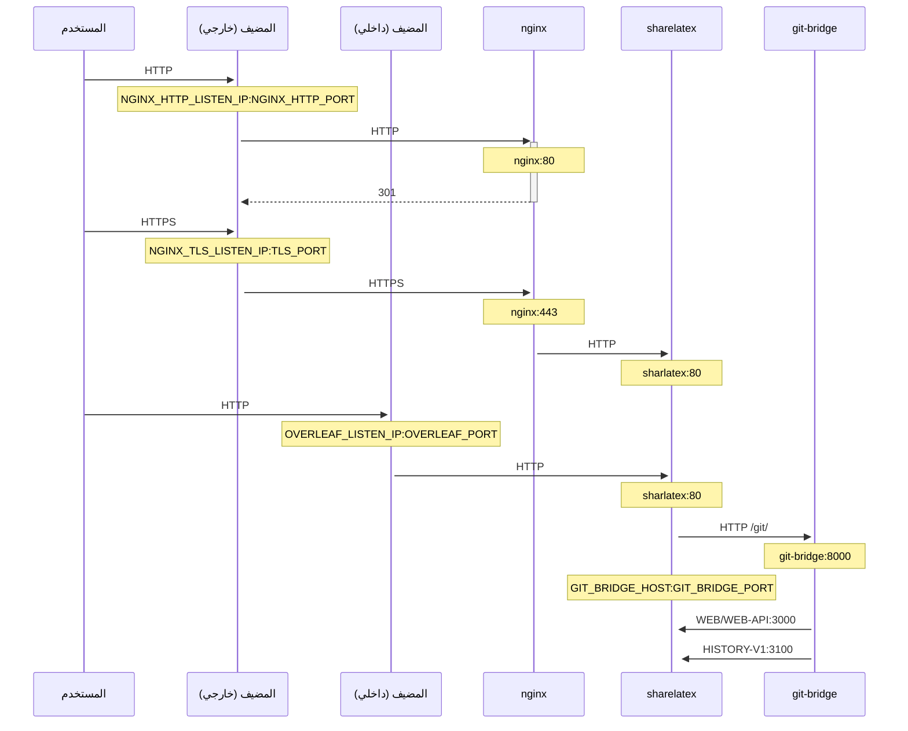

وكيل TLS اختياري لإنهاء اتصالات HTTPS باستخدام NGINX.

شغّل `bin/init --tls` لتهيئة الإعداد المحلي مع إعداد وكيل NGINX، أو لإضافة إعداد وكيل NGINX إلى إعداد محلي موجود. يُنشأ مفتاح خاص **تجريبي** في `config/nginx/certs/overleaf_key.pem` وشهادة **وهمية** في `config/nginx/certs/overleaf_certificate.pem`. إما أن تستبدلهما بمفتاحك الخاص وشهادتك الفعليين، أو أن تضبط قيمتي المتغيرين `TLS_PRIVATE_KEY_PATH` و`TLS_CERTIFICATE_PATH` على مساري مفتاحك الخاص وشهادتك الفعليين على التوالي.

يتوفر إعداد افتراضي لـ NGINX في `config/nginx/nginx.conf` يمكن تخصيصه وفقًا لاحتياجاتك. ويمكن تغيير مسار ملف الإعداد باستخدام المتغير `NGINX_CONFIG_PATH`.

<Check>

إذا كان لديك نشر قائم على **docker-compose.yml**، أو كنت تدير وكيل NGINX العكسي الخاص بك، فيمكنك الاطلاع على مثال لملف **nginx.conf** [هنا](https://github.com/overleaf/toolkit/blob/master/lib/config-seed/nginx.conf).

</Check>

أضف القسم التالي إلى ملف `config/overleaf.rc` إذا لم يكن موجودًا بالفعل:

```text
# TLS proxy configuration (optional)
NGINX_ENABLED=false
NGINX_CONFIG_PATH=config/nginx/nginx.conf
NGINX_HTTP_PORT=80

# Replace these IP addresses with the external IP address of your host
NGINX_HTTP_LISTEN_IP=127.0.1.1 
NGINX_TLS_LISTEN_IP=127.0.1.1
TLS_PRIVATE_KEY_PATH=config/nginx/certs/overleaf_key.pem
TLS_CERTIFICATE_PATH=config/nginx/certs/overleaf_certificate.pem
TLS_PORT=443
```

<Danger>

إذا كنت تستخدم وكيل TLS خارجيًا (أي لا يديره Overleaf Toolkit)، فيُرجى التأكد من ضبط `OVERLEAF_TRUSTED_PROXY_IPS=loopback,<ip-of-your-tls-proxy>` في ملف `config/variables.env`، على سبيل المثال `OVERLEAF_TRUSTED_PROXY_IPS=loopback,192.168.13.37`.

</Danger>

<Danger>

إذا كنت تستخدم شبكة فرعية من `172.16.0.0/12` (الشبكة الفرعية الافتراضية لشبكات Docker) لشبكتك المحلية، فستحتاج إلى ضبط `OVERLEAF_TRUSTED_PROXY_IPS=loopback,<network>` في ملف `config/variables.env`. حيث `<network>` هي قيمة `IPAM -> Config -> Subnet` في `docker inspect overleaf_default`، على سبيل المثال `OVERLEAF_TRUSTED_PROXY_IPS=loopback,172.19.0.0/16`. والغرض من ذلك منع انتحال ترويسات `X-Forwarded`.

</Danger>

<Info>

إذا لم يُضبط `OVERLEAF_TRUSTED_PROXY_IPS` يدويًا، فقيمته الافتراضية هي `loopback`. وإذا ضبطته يدويًا، فيجب التأكد من تضمين `loopback` (أو `127.0.0.1`)، الذي يمنح الثقة لمثيل **nginx** العامل داخل الحاوية **sharelatex**. لا تُقبل إلا عناوين IP ونطاقات CIDR: لا تُضف أسماء مضيفين مثل `localhost`، وإلا سيفشل Overleaf في البدء ويُرجع `502 Bad Gateway`.

</Info>

إذا أعددت عناوين IP للوكلاء الموثوقين بشكل صحيح، فيجب أن ترى عنوان IP العام الخاص بك في صفحة `/user/sessions` على هذا النحو:

<Frame>
  
</Frame>

إذا كان عنوان IP المعروض أعلاه لا يزال شيئًا مثل `127.0.0.1` أو عنوان IP لشبكة خاصة/محلية، فيُرجى التحقق من إعداد الوكلاء الموثوقين، ولا سيما قيمة `OVERLEAF_TRUSTED_PROXY_IPS`.

لتشغيل الوكيل، غيّر قيمة المتغير `NGINX_ENABLED` في `config/overleaf.rc` من `false` إلى `true` ثم أعد تشغيل `bin/up`.

افتراضيًا، ستكون واجهة الويب عبر HTTPS متاحة على `https://127.0.1.1:443`. وستُعاد توجيه الاتصالات إلى `http://127.0.1.1:80` نحو `https://127.0.1.1:443`. لتغيير عنوان IP الذي يستمع عليه NGINX، اضبط المتغيرين `NGINX_HTTP_LISTEN_IP` و`NGINX_TLS_LISTEN_IP`. ويمكن تغيير المنافذ عبر المتغيرين `NGINX_HTTP_PORT` و`TLS_PORT`.

إذا فشل NGINX في البدء مع رسالة الخطأ `Error starting userland proxy: listen tcp4 ... bind: address already in use`، فتأكد من أن `OVERLEAF_LISTEN_IP:OVERLEAF_PORT` لا يتداخل مع `NGINX_HTTP_LISTEN_IP:NGINX_HTTP_PORT`.


