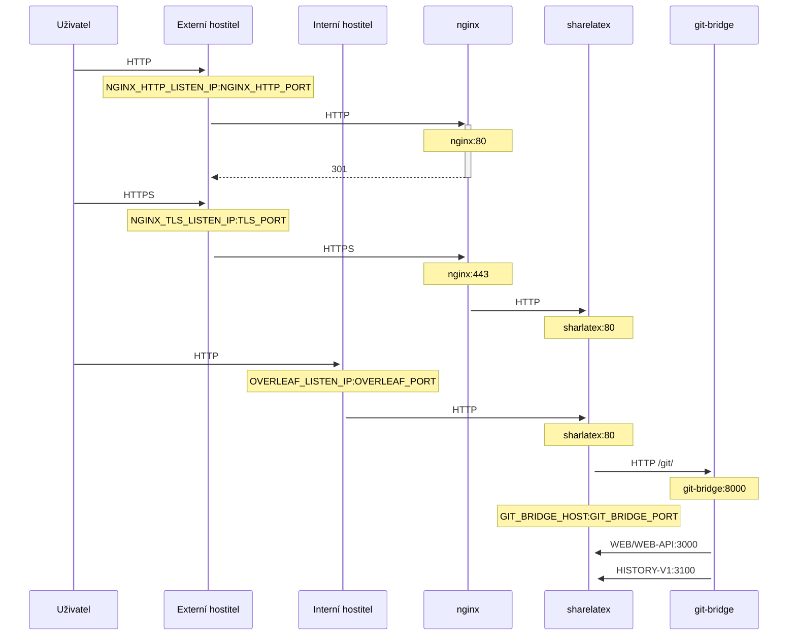

Volitelná TLS proxy pro ukončování HTTPS spojení s využitím NGINX.

Spuštěním `bin/init --tls` inicializujete lokální konfiguraci včetně konfigurace NGINX proxy, nebo přidáte konfiguraci NGINX proxy do existující lokální konfigurace. V `config/nginx/certs/overleaf_key.pem` se vytvoří **ukázkový** privátní klíč a v `config/nginx/certs/overleaf_certificate.pem` **zástupný** certifikát. Buď je nahraďte svým skutečným privátním klíčem a certifikátem, nebo nastavte proměnné `TLS_PRIVATE_KEY_PATH` a `TLS_CERTIFICATE_PATH` na cesty k vašemu skutečnému privátnímu klíči, resp. certifikátu.

Výchozí konfigurace NGINX je k dispozici v `config/nginx/nginx.conf` a lze ji přizpůsobit vašim požadavkům. Cestu ke konfiguračnímu souboru lze změnit proměnnou `NGINX_CONFIG_PATH`.

<Check>

Pokud máte nasazení založené na **docker-compose.yml** nebo spravujete vlastní reverzní proxy NGINX, ukázkový soubor **nginx.conf** najdete [zde](https://github.com/overleaf/toolkit/blob/master/lib/config-seed/nginx.conf).

</Check>

Pokud v souboru `config/overleaf.rc` ještě není, přidejte do něj následující sekci:

```text
# TLS proxy configuration (optional)
NGINX_ENABLED=false
NGINX_CONFIG_PATH=config/nginx/nginx.conf
NGINX_HTTP_PORT=80

# Replace these IP addresses with the external IP address of your host
NGINX_HTTP_LISTEN_IP=127.0.1.1 
NGINX_TLS_LISTEN_IP=127.0.1.1
TLS_PRIVATE_KEY_PATH=config/nginx/certs/overleaf_key.pem
TLS_CERTIFICATE_PATH=config/nginx/certs/overleaf_certificate.pem
TLS_PORT=443
```

<Danger>

Pokud používáte externí TLS proxy (tj. nespravovanou nástrojem Overleaf Toolkit), zajistěte, aby bylo v `config/variables.env` nastaveno `OVERLEAF_TRUSTED_PROXY_IPS=loopback,<ip-of-your-tls-proxy>`, např. `OVERLEAF_TRUSTED_PROXY_IPS=loopback,192.168.13.37`.

</Danger>

<Danger>

Pokud pro svou lokální síť používáte podsíť z rozsahu `172.16.0.0/12` (výchozí podsíť pro sítě Dockeru), musíte v `config/variables.env` nastavit `OVERLEAF_TRUSTED_PROXY_IPS=loopback,<network>`, kde `<network>` je hodnota `IPAM -> Config -> Subnet` z výstupu `docker inspect overleaf_default`, např. `OVERLEAF_TRUSTED_PROXY_IPS=loopback,172.19.0.0/16`. Tím se zabrání podvržení hlaviček `X-Forwarded`.

</Danger>

<Info>

Pokud není `OVERLEAF_TRUSTED_PROXY_IPS` nastaveno ručně, výchozí hodnota je `loopback`. Při ručním nastavení musíte zahrnout `loopback` (nebo `127.0.0.1`), čímž se důvěřuje instanci **nginx** běžící uvnitř kontejneru **sharelatex**. Přijímány jsou pouze IP adresy a rozsahy CIDR: nepřidávejte názvy hostitelů jako `localhost`, jinak se Overleaf nespustí a vrátí `502 Bad Gateway`.

</Info>

Pokud jste důvěryhodné IP adresy proxy nakonfigurovali správně, měli byste na stránce `/user/sessions` vidět svou veřejnou IP adresu, například takto:

<Frame>
  
</Frame>

Pokud je výše zobrazená IP adresa stále něco jako `127.0.0.1` nebo IP adresa privátní/lokální sítě, zkontrolujte konfiguraci důvěryhodných proxy, zejména hodnotu `OVERLEAF_TRUSTED_PROXY_IPS`.

Chcete-li proxy spustit, změňte hodnotu proměnné `NGINX_ENABLED` v `config/overleaf.rc` z `false` na `true` a znovu spusťte `bin/up`.

Ve výchozím nastavení bude webové rozhraní HTTPS dostupné na `https://127.0.1.1:443`. Spojení na `http://127.0.1.1:80` budou přesměrována na `https://127.0.1.1:443`. Chcete-li změnit IP adresu, na které NGINX naslouchá, nastavte proměnné `NGINX_HTTP_LISTEN_IP` a `NGINX_TLS_LISTEN_IP`. Porty lze změnit pomocí proměnných `NGINX_HTTP_PORT` a `TLS_PORT`.

Pokud se NGINX nespustí s chybovou zprávou `Error starting userland proxy: listen tcp4 ... bind: address already in use`, ujistěte se, že se `OVERLEAF_LISTEN_IP:OVERLEAF_PORT` nepřekrývá s `NGINX_HTTP_LISTEN_IP:NGINX_HTTP_PORT`.


