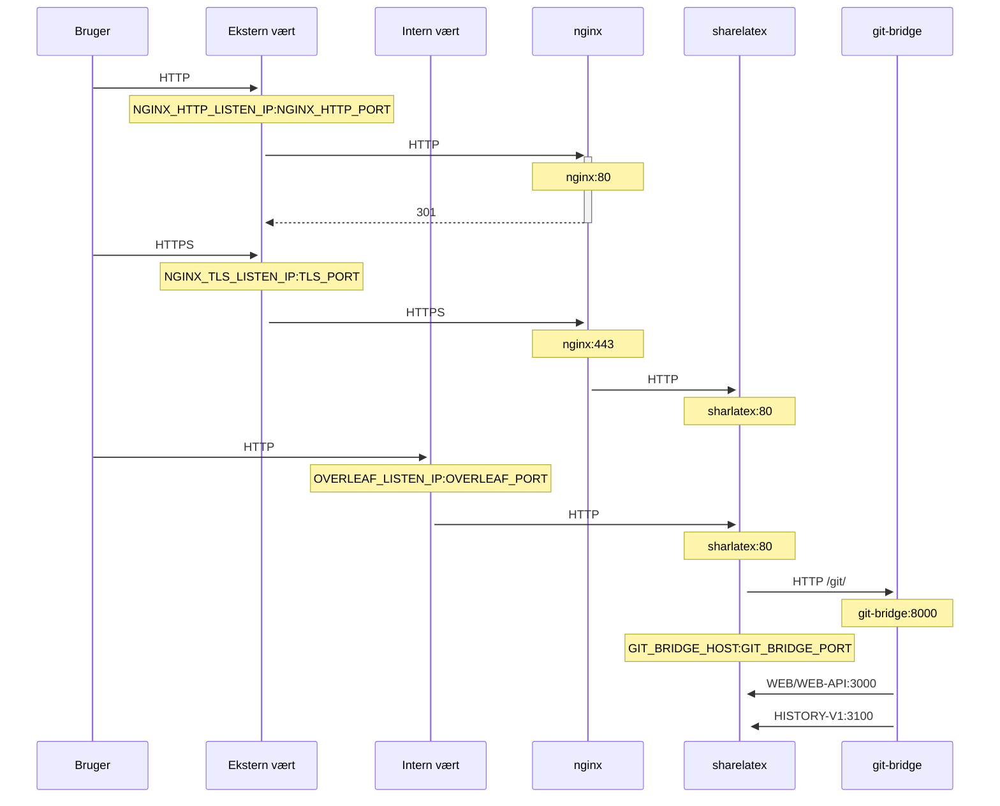

En valgfri TLS-proxy til terminering af HTTPS-forbindelser, der bruger NGINX.

Kør `bin/init --tls` for at initialisere den lokale konfiguration med NGINX-proxykonfiguration eller for at tilføje NGINX-proxykonfiguration til en eksisterende lokal konfiguration. En **eksempel**-privatnøgle oprettes i `config/nginx/certs/overleaf_key.pem` og et **dummy**-certifikat i `config/nginx/certs/overleaf_certificate.pem`. Erstat enten disse med din faktiske private nøgle og dit certifikat, eller sæt værdierne af variablerne `TLS_PRIVATE_KEY_PATH` og `TLS_CERTIFICATE_PATH` til stierne til henholdsvis din faktiske private nøgle og dit certifikat.

En standardkonfiguration for NGINX findes i `config/nginx/nginx.conf`, som kan tilpasses dine behov. Stien til konfigurationsfilen kan ændres med variablen `NGINX_CONFIG_PATH`.

<Check>

Hvis du har en installation baseret på **docker-compose.yml** eller administrerer din egen NGINX reverse proxy, kan du se et eksempel på en **nginx.conf**-fil [her](https://github.com/overleaf/toolkit/blob/master/lib/config-seed/nginx.conf).

</Check>

Tilføj følgende afsnit til din `config/overleaf.rc`-fil, hvis det ikke allerede findes:

```text
# TLS proxy configuration (optional)
NGINX_ENABLED=false
NGINX_CONFIG_PATH=config/nginx/nginx.conf
NGINX_HTTP_PORT=80

# Replace these IP addresses with the external IP address of your host
NGINX_HTTP_LISTEN_IP=127.0.1.1 
NGINX_TLS_LISTEN_IP=127.0.1.1
TLS_PRIVATE_KEY_PATH=config/nginx/certs/overleaf_key.pem
TLS_CERTIFICATE_PATH=config/nginx/certs/overleaf_certificate.pem
TLS_PORT=443
```

<Danger>

Hvis du bruger en ekstern TLS-proxy (dvs. en, der ikke administreres af Overleaf Toolkit), skal du sikre, at `OVERLEAF_TRUSTED_PROXY_IPS=loopback,<ip-of-your-tls-proxy>` er angivet i din `config/variables.env`, f.eks. `OVERLEAF_TRUSTED_PROXY_IPS=loopback,192.168.13.37`.

</Danger>

<Danger>

Hvis du bruger et subnet fra `172.16.0.0/12` (standardsubnettet for Docker-netværk) til dit lokale netværk, skal du angive `OVERLEAF_TRUSTED_PROXY_IPS=loopback,<network>` i din `config/variables.env`. Her er `<network>` værdien `IPAM -> Config -> Subnet` i `docker inspect overleaf_default`, f.eks. `OVERLEAF_TRUSTED_PROXY_IPS=loopback,172.19.0.0/16`. Dette er for at forhindre forfalskning af `X-Forwarded`-headers.

</Danger>

<Info>

Hvis `OVERLEAF_TRUSTED_PROXY_IPS` ikke angives manuelt, er standardværdien `loopback`. Hvis du angiver den manuelt, skal du sikre, at du inkluderer `loopback` (eller `127.0.0.1`), som giver tillid til den **nginx**-instans, der kører i **sharelatex**-containeren. Kun IP-adresser og CIDR-områder accepteres: Tilføj ikke værtsnavne som `localhost`, ellers kan Overleaf ikke starte og returnerer `502 Bad Gateway`.

</Info>

Hvis du har konfigureret de betroede proxy-IP'er korrekt, bør du se din offentlige IP-adresse på siden `/user/sessions` sådan her:

<Frame>
  
</Frame>

Hvis den IP-adresse, der vises ovenfor, stadig er noget i stil med `127.0.0.1` eller en IP-adresse fra et privat/lokalt netværk, skal du kontrollere din konfiguration af betroede proxyer, især værdien af `OVERLEAF_TRUSTED_PROXY_IPS`.

For at køre proxyen skal du ændre værdien af variablen `NGINX_ENABLED` i `config/overleaf.rc` fra `false` til `true` og køre `bin/up` igen.

Som standard vil HTTPS-webgrænsefladen være tilgængelig på `https://127.0.1.1:443`. Forbindelser til `http://127.0.1.1:80` omdirigeres til `https://127.0.1.1:443`. For at ændre den IP-adresse, som NGINX lytter på, skal du angive variablerne `NGINX_HTTP_LISTEN_IP` og `NGINX_TLS_LISTEN_IP`. Portene kan ændres via variablerne `NGINX_HTTP_PORT` og `TLS_PORT`.

Hvis NGINX ikke kan starte med fejlmeddelelsen `Error starting userland proxy: listen tcp4 ... bind: address already in use`, skal du sikre, at `OVERLEAF_LISTEN_IP:OVERLEAF_PORT` ikke overlapper med `NGINX_HTTP_LISTEN_IP:NGINX_HTTP_PORT`.


