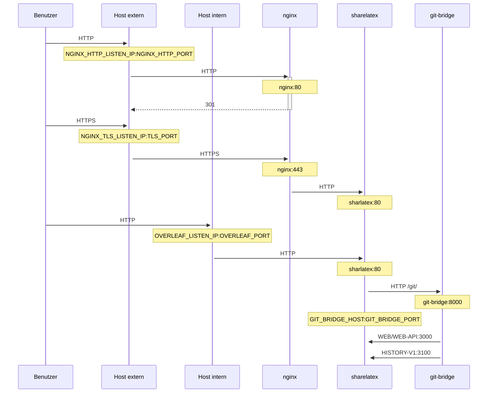

Ein optionaler TLS-Proxy zur Terminierung von HTTPS-Verbindungen auf Basis von NGINX.

Führen Sie `bin/init --tls` aus, um die lokale Konfiguration mit einer NGINX-Proxy-Konfiguration zu initialisieren oder einer bestehenden lokalen Konfiguration eine NGINX-Proxy-Konfiguration hinzuzufügen. Dabei wird ein **Beispiel**-Private-Key in `config/nginx/certs/overleaf_key.pem` und ein **Dummy**-Zertifikat in `config/nginx/certs/overleaf_certificate.pem` erstellt. Ersetzen Sie diese entweder durch Ihren tatsächlichen Private Key und Ihr Zertifikat, oder setzen Sie die Variablen `TLS_PRIVATE_KEY_PATH` und `TLS_CERTIFICATE_PATH` auf die Pfade Ihres tatsächlichen Private Keys bzw. Zertifikats.

Eine Standardkonfiguration für NGINX wird in `config/nginx/nginx.conf` bereitgestellt und kann an Ihre Anforderungen angepasst werden. Der Pfad zur Konfigurationsdatei kann über die Variable `NGINX_CONFIG_PATH` geändert werden.

<Check>

Wenn Sie ein auf **docker-compose.yml** basierendes Deployment verwenden oder Ihren eigenen NGINX-Reverse-Proxy betreiben, finden Sie [hier](https://github.com/overleaf/toolkit/blob/master/lib/config-seed/nginx.conf) eine Beispieldatei **nginx.conf**.

</Check>

Fügen Sie Ihrer Datei `config/overleaf.rc` den folgenden Abschnitt hinzu, falls er noch nicht vorhanden ist:

```text
# TLS proxy configuration (optional)
NGINX_ENABLED=false
NGINX_CONFIG_PATH=config/nginx/nginx.conf
NGINX_HTTP_PORT=80

# Replace these IP addresses with the external IP address of your host
NGINX_HTTP_LISTEN_IP=127.0.1.1 
NGINX_TLS_LISTEN_IP=127.0.1.1
TLS_PRIVATE_KEY_PATH=config/nginx/certs/overleaf_key.pem
TLS_CERTIFICATE_PATH=config/nginx/certs/overleaf_certificate.pem
TLS_PORT=443
```

<Danger>

Wenn Sie einen externen TLS-Proxy verwenden (d. h. einen, der nicht vom Overleaf Toolkit verwaltet wird), stellen Sie bitte sicher, dass in Ihrer `config/variables.env` `OVERLEAF_TRUSTED_PROXY_IPS=loopback,<ip-of-your-tls-proxy>` gesetzt ist, z. B. `OVERLEAF_TRUSTED_PROXY_IPS=loopback,192.168.13.37`.

</Danger>

<Danger>

Wenn Sie für Ihr lokales Netzwerk ein Subnetz aus `172.16.0.0/12` (Standard-Subnetz für Docker-Netzwerke) verwenden, müssen Sie in Ihrer `config/variables.env` `OVERLEAF_TRUSTED_PROXY_IPS=loopback,<network>` setzen. Dabei ist `<network>` der Wert `IPAM -> Config -> Subnet` aus `docker inspect overleaf_default`, z. B. `OVERLEAF_TRUSTED_PROXY_IPS=loopback,172.19.0.0/16`. Dies verhindert das Fälschen von `X-Forwarded`-Headern.

</Danger>

<Info>

Wenn `OVERLEAF_TRUSTED_PROXY_IPS` nicht manuell gesetzt wird, lautet der Standardwert `loopback`. Wenn Sie den Wert manuell setzen, müssen Sie `loopback` (oder `127.0.0.1`) einschließen, wodurch der **nginx**-Instanz innerhalb des **sharelatex**-Containers vertraut wird. Es werden nur IP-Adressen und CIDR-Bereiche akzeptiert: Fügen Sie keine Hostnamen wie `localhost` hinzu, da Overleaf sonst nicht startet und `502 Bad Gateway` zurückgibt.

</Info>

Wenn Sie die vertrauenswürdigen Proxy-IPs korrekt konfiguriert haben, sollten Sie Ihre öffentliche IP-Adresse auf der Seite `/user/sessions` wie folgt sehen:

<Frame>
  
</Frame>

Wenn die oben angezeigte IP-Adresse weiterhin etwa `127.0.0.1` oder eine private/lokale Netzwerkadresse ist, überprüfen Sie bitte Ihre Konfiguration der vertrauenswürdigen Proxys, insbesondere den Wert von `OVERLEAF_TRUSTED_PROXY_IPS`.

Um den Proxy zu starten, ändern Sie den Wert der Variable `NGINX_ENABLED` in `config/overleaf.rc` von `false` auf `true` und führen Sie `bin/up` erneut aus.

Standardmäßig ist die HTTPS-Weboberfläche unter `https://127.0.1.1:443` erreichbar. Verbindungen zu `http://127.0.1.1:80` werden auf `https://127.0.1.1:443` umgeleitet. Um die IP-Adresse zu ändern, auf der NGINX lauscht, setzen Sie die Variablen `NGINX_HTTP_LISTEN_IP` und `NGINX_TLS_LISTEN_IP`. Die Ports können über die Variablen `NGINX_HTTP_PORT` und `TLS_PORT` geändert werden.

Wenn NGINX mit der Fehlermeldung `Error starting userland proxy: listen tcp4 ... bind: address already in use` nicht startet, stellen Sie sicher, dass sich `OVERLEAF_LISTEN_IP:OVERLEAF_PORT` nicht mit `NGINX_HTTP_LISTEN_IP:NGINX_HTTP_PORT` überschneidet.


