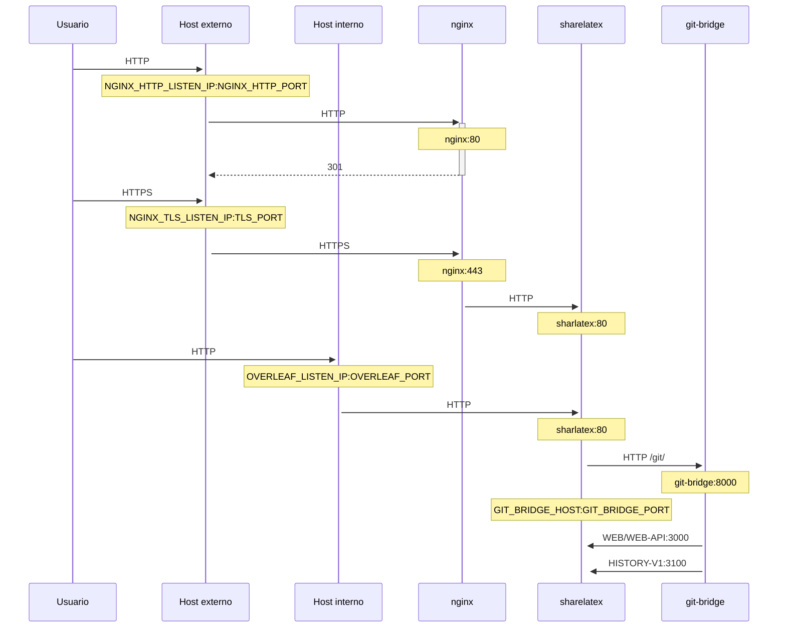

Un proxy TLS opcional para terminar las conexiones HTTPS, usando NGINX.

Ejecuta `bin/init --tls` para inicializar la configuración local con la configuración del proxy NGINX, o para añadir la configuración del proxy NGINX a una configuración local existente. Se crea una clave privada **de ejemplo** en `config/nginx/certs/overleaf_key.pem` y un certificado **ficticio** en `config/nginx/certs/overleaf_certificate.pem`. Sustitúyelos por tu clave privada y tu certificado reales, o establece los valores de las variables `TLS_PRIVATE_KEY_PATH` y `TLS_CERTIFICATE_PATH` con las rutas de tu clave privada y tu certificado reales, respectivamente.

Se proporciona una configuración predeterminada de NGINX en `config/nginx/nginx.conf`, que puede personalizarse según tus necesidades. La ruta al archivo de configuración puede cambiarse con la variable `NGINX_CONFIG_PATH`.

<Check>

Si tienes un despliegue basado en **docker-compose.yml**, o gestionas tu propio proxy inverso NGINX, puedes ver un archivo **nginx.conf** de ejemplo [aquí](https://github.com/overleaf/toolkit/blob/master/lib/config-seed/nginx.conf).

</Check>

Añade la siguiente sección a tu archivo `config/overleaf.rc` si aún no está:

```text
# TLS proxy configuration (optional)
NGINX_ENABLED=false
NGINX_CONFIG_PATH=config/nginx/nginx.conf
NGINX_HTTP_PORT=80

# Replace these IP addresses with the external IP address of your host
NGINX_HTTP_LISTEN_IP=127.0.1.1 
NGINX_TLS_LISTEN_IP=127.0.1.1
TLS_PRIVATE_KEY_PATH=config/nginx/certs/overleaf_key.pem
TLS_CERTIFICATE_PATH=config/nginx/certs/overleaf_certificate.pem
TLS_PORT=443
```

<Danger>

Si usas un proxy TLS externo (es decir, no gestionado por el Overleaf Toolkit), asegúrate de que `OVERLEAF_TRUSTED_PROXY_IPS=loopback,<ip-of-your-tls-proxy>` esté configurado en tu `config/variables.env`, por ejemplo `OVERLEAF_TRUSTED_PROXY_IPS=loopback,192.168.13.37`.

</Danger>

<Danger>

Si usas una subred de `172.16.0.0/12` (la subred predeterminada de las redes de Docker) para tu red local, tendrás que establecer `OVERLEAF_TRUSTED_PROXY_IPS=loopback,<network>` en tu `config/variables.env`, donde `<network>` es el valor de `IPAM -> Config -> Subnet` en `docker inspect overleaf_default`, por ejemplo `OVERLEAF_TRUSTED_PROXY_IPS=loopback,172.19.0.0/16`. Esto sirve para evitar la suplantación de las cabeceras `X-Forwarded`.

</Danger>

<Info>

Si `OVERLEAF_TRUSTED_PROXY_IPS` no se establece manualmente, su valor predeterminado es `loopback`. Si lo estableces manualmente, debes asegurarte de incluir `loopback` (o `127.0.0.1`), que confía en la instancia de **nginx** que se ejecuta dentro del contenedor **sharelatex**. Solo se aceptan direcciones IP y rangos CIDR: no añadas nombres de host como `localhost`; de lo contrario, Overleaf no se iniciará y devolverá `502 Bad Gateway`.

</Info>

Si has configurado correctamente las IP de proxy de confianza, deberías ver tu dirección IP pública en la página `/user/sessions`, así:

<Frame>
  
</Frame>

Si la dirección IP mostrada sigue siendo algo como `127.0.0.1` o una dirección IP de red privada/local, revisa tu configuración de proxy de confianza, especialmente el valor de `OVERLEAF_TRUSTED_PROXY_IPS`.

Para ejecutar el proxy, cambia el valor de la variable `NGINX_ENABLED` en `config/overleaf.rc` de `false` a `true` y vuelve a ejecutar `bin/up`.

De forma predeterminada, la interfaz web HTTPS estará disponible en `https://127.0.1.1:443`. Las conexiones a `http://127.0.1.1:80` se redirigirán a `https://127.0.1.1:443`. Para cambiar la dirección IP en la que escucha NGINX, establece las variables `NGINX_HTTP_LISTEN_IP` y `NGINX_TLS_LISTEN_IP`. Los puertos pueden cambiarse mediante las variables `NGINX_HTTP_PORT` y `TLS_PORT`.

Si NGINX no se inicia y muestra el mensaje de error `Error starting userland proxy: listen tcp4 ... bind: address already in use`, asegúrate de que `OVERLEAF_LISTEN_IP:OVERLEAF_PORT` no se solape con `NGINX_HTTP_LISTEN_IP:NGINX_HTTP_PORT`.


