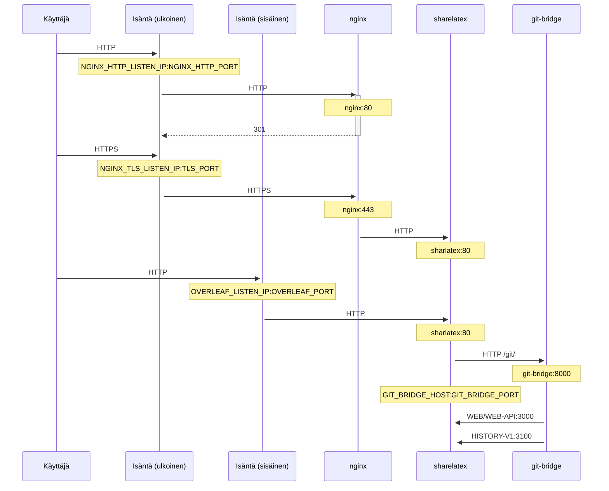

Valinnainen NGINX-pohjainen TLS-välityspalvelin HTTPS-yhteyksien päättämiseen.

Suorita `bin/init --tls` alustaaksesi paikallisen määrityksen NGINX-välityspalvelimen määrityksineen tai lisätäksesi NGINX-välityspalvelimen määrityksen olemassa olevaan paikalliseen määritykseen. **Esimerkki**yksityinen avain luodaan tiedostoon `config/nginx/certs/overleaf_key.pem` ja **testi**varmenne tiedostoon `config/nginx/certs/overleaf_certificate.pem`. Korvaa nämä joko todellisella yksityisellä avaimellasi ja varmenteellasi tai aseta muuttujien `TLS_PRIVATE_KEY_PATH` ja `TLS_CERTIFICATE_PATH` arvoiksi todellisen yksityisen avaimesi ja varmenteesi polut.

NGINX:n oletusmääritys on tiedostossa `config/nginx/nginx.conf`, ja sitä voi mukauttaa omien tarpeiden mukaan. Määritystiedoston polun voi vaihtaa muuttujalla `NGINX_CONFIG_PATH`.

<Check>

Jos käytössäsi on **docker-compose.yml**-pohjainen käyttöönotto tai hallinnoit omaa NGINX-käänteisvälityspalvelinta, voit katsoa esimerkin **nginx.conf**-tiedostosta [täältä](https://github.com/overleaf/toolkit/blob/master/lib/config-seed/nginx.conf).

</Check>

Lisää seuraava osio `config/overleaf.rc`-tiedostoosi, jos sitä ei siellä vielä ole:

```text
# TLS proxy configuration (optional)
NGINX_ENABLED=false
NGINX_CONFIG_PATH=config/nginx/nginx.conf
NGINX_HTTP_PORT=80

# Replace these IP addresses with the external IP address of your host
NGINX_HTTP_LISTEN_IP=127.0.1.1 
NGINX_TLS_LISTEN_IP=127.0.1.1
TLS_PRIVATE_KEY_PATH=config/nginx/certs/overleaf_key.pem
TLS_CERTIFICATE_PATH=config/nginx/certs/overleaf_certificate.pem
TLS_PORT=443
```

<Danger>

Jos käytät ulkoista TLS-välityspalvelinta (eli sellaista, jota Overleaf Toolkit ei hallinnoi), varmista, että `config/variables.env`-tiedostossasi on asetettu `OVERLEAF_TRUSTED_PROXY_IPS=loopback,<ip-of-your-tls-proxy>`, esim. `OVERLEAF_TRUSTED_PROXY_IPS=loopback,192.168.13.37`.

</Danger>

<Danger>

Jos paikallisverkkosi käyttää aliverkkoa alueelta `172.16.0.0/12` (Docker-verkkojen oletusaliverkko), sinun on asetettava `config/variables.env`-tiedostoon `OVERLEAF_TRUSTED_PROXY_IPS=loopback,<network>`, jossa `<network>` on komennon `docker inspect overleaf_default` tulosteen `IPAM -> Config -> Subnet` -arvo, esim. `OVERLEAF_TRUSTED_PROXY_IPS=loopback,172.19.0.0/16`. Tämä estää `X-Forwarded`-otsakkeiden väärentämisen.

</Danger>

<Info>

Jos `OVERLEAF_TRUSTED_PROXY_IPS`-muuttujaa ei aseteta käsin, sen oletusarvo on `loopback`. Jos asetat sen käsin, sinun on varmistettava, että mukana on `loopback` (tai `127.0.0.1`), joka luottaa **sharelatex**-kontin sisällä toimivaan **nginx**-instanssiin. Vain IP-osoitteet ja CIDR-alueet hyväksytään: älä lisää isäntänimiä, kuten `localhost`, muuten Overleaf ei käynnisty ja palauttaa virheen `502 Bad Gateway`.

</Info>

Jos olet määrittänyt luotetut välityspalvelimen IP-osoitteet oikein, sinun pitäisi nähdä julkinen IP-osoitteesi `/user/sessions`-sivulla näin:

<Frame>
  
</Frame>

Jos yllä näkyvä IP-osoite on edelleen esimerkiksi `127.0.0.1` tai yksityisen/paikallisen verkon IP-osoite, tarkista luotettujen välityspalvelinten määritys, erityisesti `OVERLEAF_TRUSTED_PROXY_IPS`-muuttujan arvo.

Käynnistä välityspalvelin muuttamalla `config/overleaf.rc`-tiedoston `NGINX_ENABLED`-muuttujan arvo `false`-arvosta `true`-arvoon ja suorittamalla `bin/up` uudelleen.

Oletuksena HTTPS-verkkokäyttöliittymä on saatavilla osoitteessa `https://127.0.1.1:443`. Yhteydet osoitteeseen `http://127.0.1.1:80` ohjataan osoitteeseen `https://127.0.1.1:443`. Voit vaihtaa IP-osoitteen, jota NGINX kuuntelee, asettamalla muuttujat `NGINX_HTTP_LISTEN_IP` ja `NGINX_TLS_LISTEN_IP`. Portit voi vaihtaa muuttujilla `NGINX_HTTP_PORT` ja `TLS_PORT`.

Jos NGINX ei käynnisty ja antaa virheilmoituksen `Error starting userland proxy: listen tcp4 ... bind: address already in use`, varmista, että `OVERLEAF_LISTEN_IP:OVERLEAF_PORT` ei ole päällekkäinen `NGINX_HTTP_LISTEN_IP:NGINX_HTTP_PORT`-yhdistelmän kanssa.


