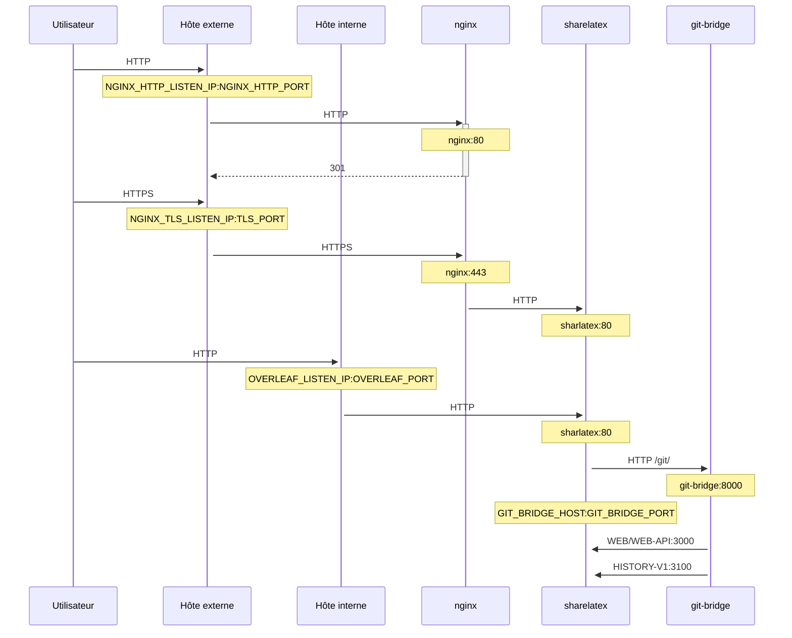

Un proxy TLS optionnel, basé sur NGINX, pour terminer les connexions HTTPS.

Exécutez `bin/init --tls` pour initialiser la configuration locale avec la configuration du proxy NGINX, ou pour ajouter la configuration du proxy NGINX à une configuration locale existante. Une clé privée **d'exemple** est créée dans `config/nginx/certs/overleaf_key.pem` et un certificat **factice** dans `config/nginx/certs/overleaf_certificate.pem`. Remplacez-les par votre véritable clé privée et votre véritable certificat, ou définissez les variables `TLS_PRIVATE_KEY_PATH` et `TLS_CERTIFICATE_PATH` avec les chemins de votre clé privée et de votre certificat respectivement.

Une configuration NGINX par défaut est fournie dans `config/nginx/nginx.conf` et peut être personnalisée selon vos besoins. Le chemin du fichier de configuration peut être modifié avec la variable `NGINX_CONFIG_PATH`.

<Check>

Si votre déploiement est basé sur **docker-compose.yml**, ou si vous gérez votre propre reverse proxy NGINX, vous pouvez consulter un exemple de fichier **nginx.conf** [ici](https://github.com/overleaf/toolkit/blob/master/lib/config-seed/nginx.conf).

</Check>

Ajoutez la section suivante à votre fichier `config/overleaf.rc` si elle n'y figure pas déjà :

```text
# TLS proxy configuration (optional)
NGINX_ENABLED=false
NGINX_CONFIG_PATH=config/nginx/nginx.conf
NGINX_HTTP_PORT=80

# Replace these IP addresses with the external IP address of your host
NGINX_HTTP_LISTEN_IP=127.0.1.1 
NGINX_TLS_LISTEN_IP=127.0.1.1
TLS_PRIVATE_KEY_PATH=config/nginx/certs/overleaf_key.pem
TLS_CERTIFICATE_PATH=config/nginx/certs/overleaf_certificate.pem
TLS_PORT=443
```

<Danger>

Si vous utilisez un proxy TLS externe (c'est-à-dire non géré par l'Overleaf Toolkit), assurez-vous que `OVERLEAF_TRUSTED_PROXY_IPS=loopback,<ip-of-your-tls-proxy>` est défini dans votre `config/variables.env`, par exemple `OVERLEAF_TRUSTED_PROXY_IPS=loopback,192.168.13.37`.

</Danger>

<Danger>

Si votre réseau local utilise un sous-réseau de `172.16.0.0/12` (sous-réseau par défaut des réseaux Docker), vous devrez définir `OVERLEAF_TRUSTED_PROXY_IPS=loopback,<network>` dans votre `config/variables.env`, où `<network>` est la valeur `IPAM -> Config -> Subnet` de `docker inspect overleaf_default`, par exemple `OVERLEAF_TRUSTED_PROXY_IPS=loopback,172.19.0.0/16`. Cela permet d'empêcher l'usurpation des en-têtes `X-Forwarded`.

</Danger>

<Info>

Si `OVERLEAF_TRUSTED_PROXY_IPS` n'est pas défini manuellement, sa valeur par défaut est `loopback`. Si vous le définissez manuellement, vous devez veiller à inclure `loopback` (ou `127.0.0.1`), qui accorde la confiance à l'instance **nginx** exécutée dans le conteneur **sharelatex**. Seules les adresses IP et les plages CIDR sont acceptées : n'ajoutez pas de noms d'hôte tels que `localhost`, sinon Overleaf ne démarrera pas et renverra `502 Bad Gateway`.

</Info>

Si vous avez correctement configuré les IP de proxy de confiance, vous devriez voir votre adresse IP publique sur la page `/user/sessions`, comme ceci :

<Frame>
  
</Frame>

Si l'adresse IP affichée ci-dessus est encore du type `127.0.0.1` ou une adresse IP de réseau privé/local, vérifiez votre configuration de proxy de confiance, en particulier la valeur de `OVERLEAF_TRUSTED_PROXY_IPS`.

Pour exécuter le proxy, passez la valeur de la variable `NGINX_ENABLED` de `false` à `true` dans `config/overleaf.rc` et relancez `bin/up`.

Par défaut, l'interface web HTTPS est disponible sur `https://127.0.1.1:443`. Les connexions à `http://127.0.1.1:80` sont redirigées vers `https://127.0.1.1:443`. Pour modifier l'adresse IP sur laquelle NGINX écoute, définissez les variables `NGINX_HTTP_LISTEN_IP` et `NGINX_TLS_LISTEN_IP`. Les ports peuvent être modifiés via les variables `NGINX_HTTP_PORT` et `TLS_PORT`.

Si NGINX ne démarre pas avec le message d'erreur `Error starting userland proxy: listen tcp4 ... bind: address already in use`, assurez-vous que `OVERLEAF_LISTEN_IP:OVERLEAF_PORT` ne chevauche pas `NGINX_HTTP_LISTEN_IP:NGINX_HTTP_PORT`.


