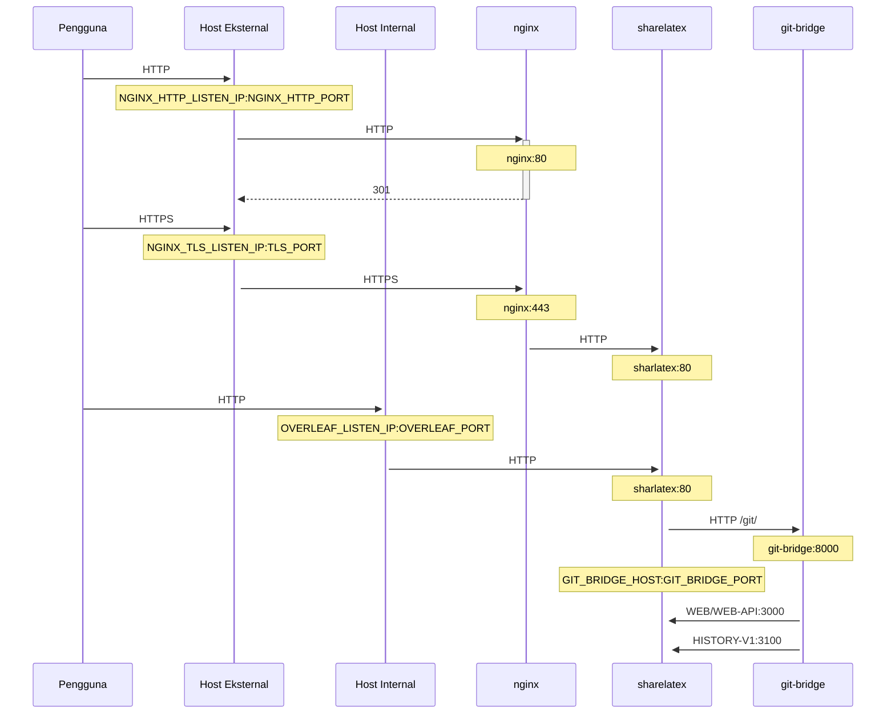

Proxy TLS opsional untuk mengakhiri koneksi HTTPS, menggunakan NGINX.

Jalankan `bin/init --tls` untuk menginisialisasi konfigurasi lokal dengan konfigurasi proxy NGINX, atau untuk menambahkan konfigurasi proxy NGINX ke konfigurasi lokal yang sudah ada. Sebuah private key **contoh** dibuat di `config/nginx/certs/overleaf_key.pem` dan sertifikat **dummy** di `config/nginx/certs/overleaf_certificate.pem`. Ganti keduanya dengan private key dan sertifikat Anda yang sebenarnya, atau atur nilai variabel `TLS_PRIVATE_KEY_PATH` dan `TLS_CERTIFICATE_PATH` ke path private key dan sertifikat Anda yang sebenarnya.

Konfigurasi default untuk NGINX disediakan di `config/nginx/nginx.conf` yang dapat disesuaikan dengan kebutuhan Anda. Path ke file konfigurasi dapat diubah dengan variabel `NGINX_CONFIG_PATH`.

<Check>

Jika Anda memiliki deployment berbasis **docker-compose.yml**, atau mengelola reverse proxy NGINX Anda sendiri, Anda dapat melihat contoh file **nginx.conf** [di sini](https://github.com/overleaf/toolkit/blob/master/lib/config-seed/nginx.conf).

</Check>

Tambahkan bagian berikut ke file `config/overleaf.rc` Anda jika belum ada:

```text
# TLS proxy configuration (optional)
NGINX_ENABLED=false
NGINX_CONFIG_PATH=config/nginx/nginx.conf
NGINX_HTTP_PORT=80

# Replace these IP addresses with the external IP address of your host
NGINX_HTTP_LISTEN_IP=127.0.1.1 
NGINX_TLS_LISTEN_IP=127.0.1.1
TLS_PRIVATE_KEY_PATH=config/nginx/certs/overleaf_key.pem
TLS_CERTIFICATE_PATH=config/nginx/certs/overleaf_certificate.pem
TLS_PORT=443
```

<Danger>

Jika Anda menggunakan proxy TLS eksternal (yaitu tidak dikelola oleh Overleaf Toolkit), pastikan `OVERLEAF_TRUSTED_PROXY_IPS=loopback,<ip-of-your-tls-proxy>` diatur di `config/variables.env` Anda, misalnya `OVERLEAF_TRUSTED_PROXY_IPS=loopback,192.168.13.37`.

</Danger>

<Danger>

Jika Anda menggunakan subnet dari `172.16.0.0/12` (subnet default untuk jaringan Docker) untuk jaringan lokal Anda, Anda perlu mengatur `OVERLEAF_TRUSTED_PROXY_IPS=loopback,<network>` di `config/variables.env` Anda, dengan `<network>` adalah nilai `IPAM -> Config -> Subnet` pada `docker inspect overleaf_default`, misalnya `OVERLEAF_TRUSTED_PROXY_IPS=loopback,172.19.0.0/16`. Hal ini untuk mencegah pemalsuan header `X-Forwarded`.

</Danger>

<Info>

Jika `OVERLEAF_TRUSTED_PROXY_IPS` tidak diatur secara manual, nilainya default ke `loopback`. Jika mengaturnya secara manual, Anda harus memastikan untuk menyertakan `loopback` (atau `127.0.0.1`), yang memercayai instance **nginx** yang berjalan di dalam container **sharelatex**. Hanya alamat IP dan rentang CIDR yang diterima: jangan menambahkan nama host seperti `localhost`, jika tidak Overleaf akan gagal dijalankan dan mengembalikan `502 Bad Gateway`.

</Info>

Jika Anda telah mengonfigurasi IP proxy tepercaya dengan benar, Anda akan melihat alamat IP publik Anda di halaman `/user/sessions` seperti ini:

<Frame>
  
</Frame>

Jika alamat IP yang ditampilkan di atas masih berupa `127.0.0.1` atau alamat IP jaringan privat/lokal, periksa konfigurasi proxy tepercaya Anda, terutama nilai `OVERLEAF_TRUSTED_PROXY_IPS`.

Untuk menjalankan proxy, ubah nilai variabel `NGINX_ENABLED` di `config/overleaf.rc` dari `false` menjadi `true` lalu jalankan ulang `bin/up`.

Secara default, antarmuka web HTTPS akan tersedia di `https://127.0.1.1:443`. Koneksi ke `http://127.0.1.1:80` akan dialihkan ke `https://127.0.1.1:443`. Untuk mengubah alamat IP yang didengarkan NGINX, atur variabel `NGINX_HTTP_LISTEN_IP` dan `NGINX_TLS_LISTEN_IP`. Port dapat diubah melalui variabel `NGINX_HTTP_PORT` dan `TLS_PORT`.

Jika NGINX gagal dijalankan dengan pesan error `Error starting userland proxy: listen tcp4 ... bind: address already in use`, pastikan `OVERLEAF_LISTEN_IP:OVERLEAF_PORT` tidak tumpang tindih dengan `NGINX_HTTP_LISTEN_IP:NGINX_HTTP_PORT`.


