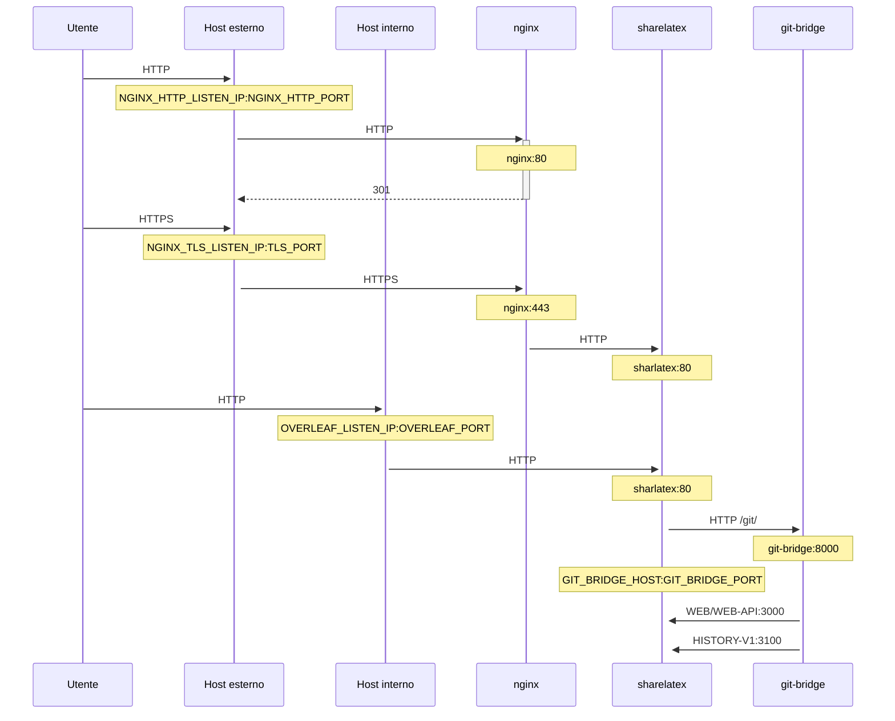

Un proxy TLS opzionale per terminare le connessioni HTTPS, basato su NGINX.

Esegui `bin/init --tls` per inizializzare la configurazione locale con la configurazione del proxy NGINX, oppure per aggiungere la configurazione del proxy NGINX a una configurazione locale esistente. Vengono creati una chiave privata **di esempio** in `config/nginx/certs/overleaf_key.pem` e un certificato **fittizio** in `config/nginx/certs/overleaf_certificate.pem`. Sostituiscili con la tua chiave privata e il tuo certificato reali, oppure imposta i valori delle variabili `TLS_PRIVATE_KEY_PATH` e `TLS_CERTIFICATE_PATH` rispettivamente sui percorsi della tua chiave privata e del tuo certificato reali.

In `config/nginx/nginx.conf` è fornita una configurazione predefinita per NGINX, che può essere personalizzata in base alle tue esigenze. Il percorso del file di configurazione può essere modificato con la variabile `NGINX_CONFIG_PATH`.

<Check>

Se hai un'installazione basata su **docker-compose.yml** o gestisci un tuo reverse proxy NGINX, puoi consultare un file **nginx.conf** di esempio [qui](https://github.com/overleaf/toolkit/blob/master/lib/config-seed/nginx.conf).

</Check>

Aggiungi la seguente sezione al file `config/overleaf.rc` se non è già presente:

```text
# TLS proxy configuration (optional)
NGINX_ENABLED=false
NGINX_CONFIG_PATH=config/nginx/nginx.conf
NGINX_HTTP_PORT=80

# Replace these IP addresses with the external IP address of your host
NGINX_HTTP_LISTEN_IP=127.0.1.1 
NGINX_TLS_LISTEN_IP=127.0.1.1
TLS_PRIVATE_KEY_PATH=config/nginx/certs/overleaf_key.pem
TLS_CERTIFICATE_PATH=config/nginx/certs/overleaf_certificate.pem
TLS_PORT=443
```

<Danger>

Se usi un proxy TLS esterno (cioè non gestito dall'Overleaf Toolkit), assicurati che nel tuo `config/variables.env` sia impostato `OVERLEAF_TRUSTED_PROXY_IPS=loopback,<ip-of-your-tls-proxy>`, ad esempio `OVERLEAF_TRUSTED_PROXY_IPS=loopback,192.168.13.37`.

</Danger>

<Danger>

Se per la tua rete locale usi una subnet di `172.16.0.0/12` (la subnet predefinita per le reti Docker), dovrai impostare `OVERLEAF_TRUSTED_PROXY_IPS=loopback,<network>` nel tuo `config/variables.env`, dove `<network>` è il valore `IPAM -> Config -> Subnet` restituito da `docker inspect overleaf_default`, ad esempio `OVERLEAF_TRUSTED_PROXY_IPS=loopback,172.19.0.0/16`. Questo serve a impedire lo spoofing degli header `X-Forwarded`.

</Danger>

<Info>

Se `OVERLEAF_TRUSTED_PROXY_IPS` non viene impostata manualmente, il valore predefinito è `loopback`. Se la imposti manualmente, devi assicurarti di includere `loopback` (o `127.0.0.1`), che rende attendibile l'istanza **nginx** in esecuzione all'interno del container **sharelatex**. Sono accettati solo indirizzi IP e intervalli CIDR: non aggiungere nomi host come `localhost`, altrimenti Overleaf non si avvia e restituisce `502 Bad Gateway`.

</Info>

Se hai configurato correttamente gli IP dei proxy attendibili, nella pagina `/user/sessions` dovresti vedere il tuo indirizzo IP pubblico, in questo modo:

<Frame>
  
</Frame>

Se l'indirizzo IP mostrato sopra è ancora qualcosa come `127.0.0.1` o un indirizzo IP di rete privata/locale, controlla la configurazione dei proxy attendibili, in particolare il valore di `OVERLEAF_TRUSTED_PROXY_IPS`.

Per eseguire il proxy, cambia il valore della variabile `NGINX_ENABLED` in `config/overleaf.rc` da `false` a `true` ed esegui di nuovo `bin/up`.

Per impostazione predefinita, l'interfaccia web HTTPS sarà disponibile su `https://127.0.1.1:443`. Le connessioni a `http://127.0.1.1:80` verranno reindirizzate a `https://127.0.1.1:443`. Per cambiare l'indirizzo IP su cui NGINX è in ascolto, imposta le variabili `NGINX_HTTP_LISTEN_IP` e `NGINX_TLS_LISTEN_IP`. Le porte possono essere modificate tramite le variabili `NGINX_HTTP_PORT` e `TLS_PORT`.

Se NGINX non si avvia con il messaggio di errore `Error starting userland proxy: listen tcp4 ... bind: address already in use`, assicurati che `OVERLEAF_LISTEN_IP:OVERLEAF_PORT` non si sovrapponga a `NGINX_HTTP_LISTEN_IP:NGINX_HTTP_PORT`.


