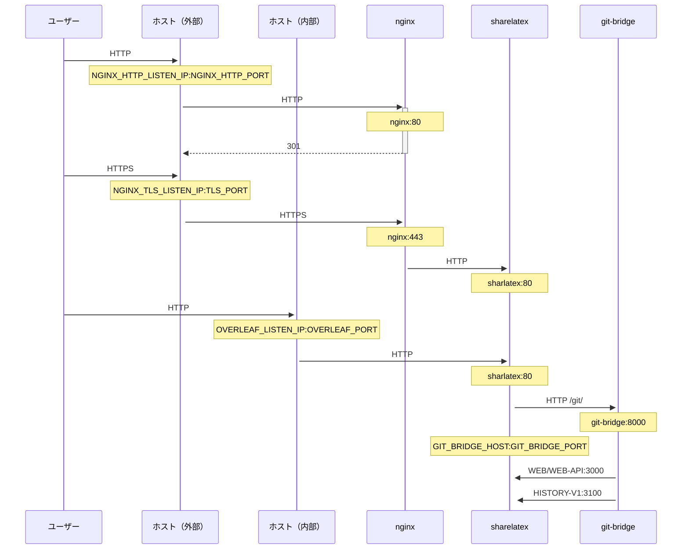

NGINX を使用して HTTPS 接続を終端する、オプションの TLS プロキシです。

`bin/init --tls` を実行すると、NGINX プロキシ設定を含むローカル設定を初期化するか、既存のローカル設定に NGINX プロキシ設定を追加できます。`config/nginx/certs/overleaf_key.pem` に**サンプル**の秘密鍵が、`config/nginx/certs/overleaf_certificate.pem` に**ダミー**の証明書が作成されます。これらを実際の秘密鍵と証明書に置き換えるか、`TLS_PRIVATE_KEY_PATH` 変数と `TLS_CERTIFICATE_PATH` 変数の値をそれぞれ実際の秘密鍵と証明書のパスに設定してください。

NGINX のデフォルト設定は `config/nginx/nginx.conf` に用意されており、要件に合わせてカスタマイズできます。設定ファイルのパスは `NGINX_CONFIG_PATH` 変数で変更できます。

<Check>

**docker-compose.yml** ベースのデプロイを使用している場合や、独自の NGINX リバースプロキシを管理している場合は、[こちら](https://github.com/overleaf/toolkit/blob/master/lib/config-seed/nginx.conf)で **nginx.conf** ファイルの例を確認できます。

</Check>

`config/overleaf.rc` ファイルに次のセクションがまだない場合は追加します。

```text
# TLS proxy configuration (optional)
NGINX_ENABLED=false
NGINX_CONFIG_PATH=config/nginx/nginx.conf
NGINX_HTTP_PORT=80

# Replace these IP addresses with the external IP address of your host
NGINX_HTTP_LISTEN_IP=127.0.1.1 
NGINX_TLS_LISTEN_IP=127.0.1.1
TLS_PRIVATE_KEY_PATH=config/nginx/certs/overleaf_key.pem
TLS_CERTIFICATE_PATH=config/nginx/certs/overleaf_certificate.pem
TLS_PORT=443
```

<Danger>

外部の TLS プロキシ（つまり Overleaf Toolkit で管理されていないもの）を使用している場合は、`config/variables.env` で `OVERLEAF_TRUSTED_PROXY_IPS=loopback,<ip-of-your-tls-proxy>` が設定されていることを確認してください。例: `OVERLEAF_TRUSTED_PROXY_IPS=loopback,192.168.13.37`。

</Danger>

<Danger>

ローカルネットワークに `172.16.0.0/12`（Docker ネットワークのデフォルトサブネット）のサブネットを使用している場合は、`config/variables.env` で `OVERLEAF_TRUSTED_PROXY_IPS=loopback,<network>` を設定する必要があります。`<network>` は `docker inspect overleaf_default` の `IPAM -> Config -> Subnet` の値です。例: `OVERLEAF_TRUSTED_PROXY_IPS=loopback,172.19.0.0/16`。これは `X-Forwarded` ヘッダーのなりすましを防ぐためです。

</Danger>

<Info>

`OVERLEAF_TRUSTED_PROXY_IPS` を手動で設定しない場合、デフォルトは `loopback` になります。手動で設定する場合は、**sharelatex** コンテナ内で動作する **nginx** インスタンスを信頼するために、必ず `loopback`（または `127.0.0.1`）を含めてください。指定できるのは IP アドレスと CIDR 範囲のみです。`localhost` のようなホスト名を追加しないでください。追加すると Overleaf の起動に失敗し、`502 Bad Gateway` が返されます。

</Info>

信頼済みプロキシ IP を正しく設定していれば、`/user/sessions` ページに次のようにパブリック IP アドレスが表示されます。

<Frame>
  
</Frame>

上に表示される IP アドレスが依然として `127.0.0.1` やプライベート／ローカルネットワークの IP アドレスのような値である場合は、信頼済みプロキシの設定、特に `OVERLEAF_TRUSTED_PROXY_IPS` の値を確認してください。

プロキシを実行するには、`config/overleaf.rc` の `NGINX_ENABLED` 変数の値を `false` から `true` に変更し、`bin/up` を再実行します。

デフォルトでは、HTTPS の Web インターフェースは `https://127.0.1.1:443` で利用できます。`http://127.0.1.1:80` への接続は `https://127.0.1.1:443` にリダイレクトされます。NGINX がリッスンする IP アドレスを変更するには、`NGINX_HTTP_LISTEN_IP` 変数と `NGINX_TLS_LISTEN_IP` 変数を設定します。ポートは `NGINX_HTTP_PORT` 変数と `TLS_PORT` 変数で変更できます。

NGINX が `Error starting userland proxy: listen tcp4 ... bind: address already in use` というエラーメッセージで起動に失敗する場合は、`OVERLEAF_LISTEN_IP:OVERLEAF_PORT` が `NGINX_HTTP_LISTEN_IP:NGINX_HTTP_PORT` と重複していないことを確認してください。


