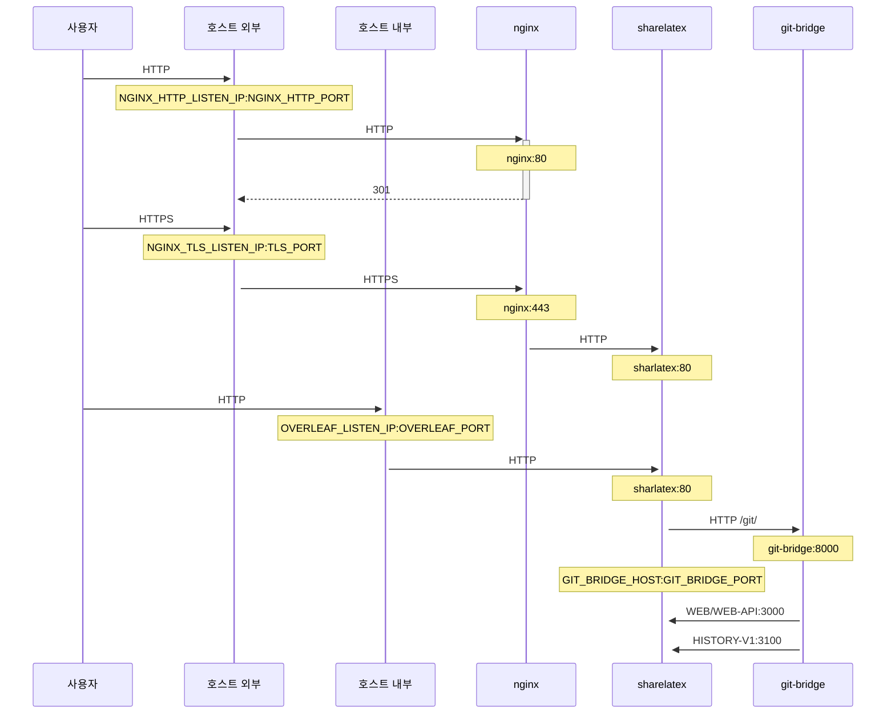

NGINX를 사용하여 HTTPS 연결을 종료(termination)하는 선택적 TLS 프록시입니다.

`bin/init --tls`를 실행하면 NGINX 프록시 설정과 함께 로컬 설정을 초기화하거나, 기존 로컬 설정에 NGINX 프록시 설정을 추가할 수 있습니다. **샘플** 개인 키가 `config/nginx/certs/overleaf_key.pem`에, **더미** 인증서가 `config/nginx/certs/overleaf_certificate.pem`에 생성됩니다. 이 파일들을 실제 개인 키와 인증서로 교체하거나, `TLS_PRIVATE_KEY_PATH`와 `TLS_CERTIFICATE_PATH` 변수 값을 각각 실제 개인 키와 인증서의 경로로 설정하세요.

NGINX의 기본 설정은 `config/nginx/nginx.conf`에 제공되며, 필요에 맞게 사용자 지정할 수 있습니다. 설정 파일 경로는 `NGINX_CONFIG_PATH` 변수로 변경할 수 있습니다.

<Check>

**docker-compose.yml** 기반으로 배포했거나 직접 NGINX 리버스 프록시를 관리하는 경우, [여기](https://github.com/overleaf/toolkit/blob/master/lib/config-seed/nginx.conf)에서 **nginx.conf** 예시 파일을 볼 수 있습니다.

</Check>

`config/overleaf.rc` 파일에 다음 섹션이 아직 없다면 추가하세요:

```text
# TLS proxy configuration (optional)
NGINX_ENABLED=false
NGINX_CONFIG_PATH=config/nginx/nginx.conf
NGINX_HTTP_PORT=80

# Replace these IP addresses with the external IP address of your host
NGINX_HTTP_LISTEN_IP=127.0.1.1 
NGINX_TLS_LISTEN_IP=127.0.1.1
TLS_PRIVATE_KEY_PATH=config/nginx/certs/overleaf_key.pem
TLS_CERTIFICATE_PATH=config/nginx/certs/overleaf_certificate.pem
TLS_PORT=443
```

<Danger>

외부 TLS 프록시(즉, Overleaf Toolkit에서 관리하지 않는 프록시)를 사용하는 경우, `config/variables.env`에 `OVERLEAF_TRUSTED_PROXY_IPS=loopback,<ip-of-your-tls-proxy>`가 설정되어 있는지 확인하세요. 예: `OVERLEAF_TRUSTED_PROXY_IPS=loopback,192.168.13.37`.

</Danger>

<Danger>

로컬 네트워크에 `172.16.0.0/12`(Docker 네트워크의 기본 서브넷)의 서브넷을 사용하는 경우, `config/variables.env`에 `OVERLEAF_TRUSTED_PROXY_IPS=loopback,<network>`를 설정해야 합니다. 여기서 `<network>`는 `docker inspect overleaf_default`의 `IPAM -> Config -> Subnet` 값입니다. 예: `OVERLEAF_TRUSTED_PROXY_IPS=loopback,172.19.0.0/16`. 이는 `X-Forwarded` 헤더 위조를 방지하기 위한 것입니다.

</Danger>

<Info>

`OVERLEAF_TRUSTED_PROXY_IPS`를 수동으로 설정하지 않으면 기본값은 `loopback`입니다. 수동으로 설정하는 경우 반드시 `loopback`(또는 `127.0.0.1`)을 포함해야 하며, 이는 **sharelatex** 컨테이너 내부에서 실행되는 **nginx** 인스턴스를 신뢰하기 위함입니다. IP 주소와 CIDR 범위만 허용됩니다. `localhost`와 같은 호스트 이름을 추가하지 마세요. 그렇지 않으면 Overleaf가 시작되지 않고 `502 Bad Gateway`를 반환합니다.

</Info>

신뢰할 수 있는 프록시 IP를 올바르게 설정했다면 `/user/sessions` 페이지에서 다음과 같이 공인 IP 주소를 확인할 수 있습니다:

<Frame>
  
</Frame>

위에 표시된 IP 주소가 여전히 `127.0.0.1`과 같은 주소이거나 사설/로컬 네트워크 IP 주소라면, 신뢰할 수 있는 프록시 설정, 특히 `OVERLEAF_TRUSTED_PROXY_IPS` 값을 확인하세요.

프록시를 실행하려면 `config/overleaf.rc`에서 `NGINX_ENABLED` 변수 값을 `false`에서 `true`로 변경하고 `bin/up`을 다시 실행하세요.

기본적으로 HTTPS 웹 인터페이스는 `https://127.0.1.1:443`에서 사용할 수 있습니다. `http://127.0.1.1:80`으로의 연결은 `https://127.0.1.1:443`으로 리디렉션됩니다. NGINX가 수신 대기하는 IP 주소를 변경하려면 `NGINX_HTTP_LISTEN_IP`와 `NGINX_TLS_LISTEN_IP` 변수를 설정하세요. 포트는 `NGINX_HTTP_PORT`와 `TLS_PORT` 변수로 변경할 수 있습니다.

NGINX가 `Error starting userland proxy: listen tcp4 ... bind: address already in use` 오류 메시지와 함께 시작되지 않으면, `OVERLEAF_LISTEN_IP:OVERLEAF_PORT`가 `NGINX_HTTP_LISTEN_IP:NGINX_HTTP_PORT`와 겹치지 않는지 확인하세요.


