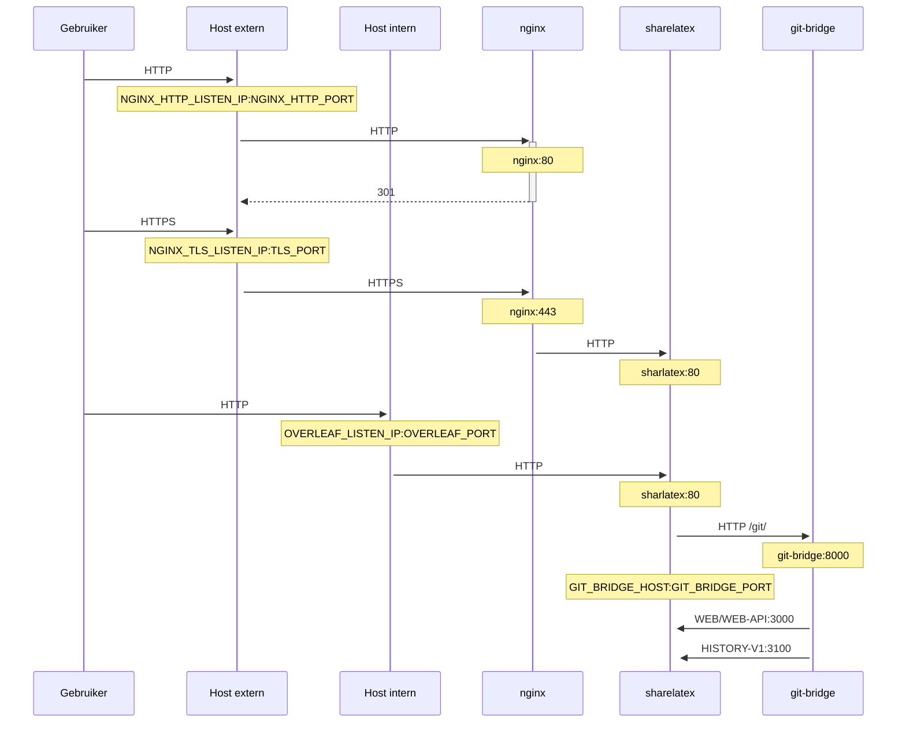

Een optionele TLS-proxy voor het afhandelen (termineren) van HTTPS-verbindingen, met behulp van NGINX.

Voer `bin/init --tls` uit om een lokale configuratie met NGINX-proxyconfiguratie te initialiseren, of om NGINX-proxyconfiguratie aan een bestaande lokale configuratie toe te voegen. Er wordt een **voorbeeld**-privésleutel aangemaakt in `config/nginx/certs/overleaf_key.pem` en een **dummy**-certificaat in `config/nginx/certs/overleaf_certificate.pem`. Vervang deze door je eigen privésleutel en certificaat, of stel de waarden van de variabelen `TLS_PRIVATE_KEY_PATH` en `TLS_CERTIFICATE_PATH` in op de paden van respectievelijk je eigen privésleutel en certificaat.

Een standaardconfiguratie voor NGINX staat in `config/nginx/nginx.conf` en kan naar wens worden aangepast. Het pad naar het configuratiebestand kan worden gewijzigd met de variabele `NGINX_CONFIG_PATH`.

<Check>

Als je een deployment op basis van **docker-compose.yml** hebt, of je eigen NGINX-reverse-proxy beheert, kun je [hier](https://github.com/overleaf/toolkit/blob/master/lib/config-seed/nginx.conf) een voorbeeldbestand **nginx.conf** bekijken.

</Check>

Voeg de volgende sectie toe aan je bestand `config/overleaf.rc` als die er nog niet in staat:

```text
# TLS proxy configuration (optional)
NGINX_ENABLED=false
NGINX_CONFIG_PATH=config/nginx/nginx.conf
NGINX_HTTP_PORT=80

# Replace these IP addresses with the external IP address of your host
NGINX_HTTP_LISTEN_IP=127.0.1.1 
NGINX_TLS_LISTEN_IP=127.0.1.1
TLS_PRIVATE_KEY_PATH=config/nginx/certs/overleaf_key.pem
TLS_CERTIFICATE_PATH=config/nginx/certs/overleaf_certificate.pem
TLS_PORT=443
```

<Danger>

Als je een externe TLS-proxy gebruikt (d.w.z. een die niet door de Overleaf Toolkit wordt beheerd), zorg er dan voor dat `OVERLEAF_TRUSTED_PROXY_IPS=loopback,<ip-of-your-tls-proxy>` is ingesteld in je `config/variables.env`, bijvoorbeeld `OVERLEAF_TRUSTED_PROXY_IPS=loopback,192.168.13.37`.

</Danger>

<Danger>

Als je voor je lokale netwerk een subnet uit `172.16.0.0/12` gebruikt (het standaardsubnet voor Docker-netwerken), moet je `OVERLEAF_TRUSTED_PROXY_IPS=loopback,<network>` instellen in je `config/variables.env`. Hierbij is `<network>` de waarde van `IPAM -> Config -> Subnet` in `docker inspect overleaf_default`, bijvoorbeeld `OVERLEAF_TRUSTED_PROXY_IPS=loopback,172.19.0.0/16`. Dit voorkomt het vervalsen van `X-Forwarded`-headers.

</Danger>

<Info>

Als `OVERLEAF_TRUSTED_PROXY_IPS` niet handmatig is ingesteld, is de standaardwaarde `loopback`. Als je de waarde handmatig instelt, moet je `loopback` (of `127.0.0.1`) opnemen, waarmee de **nginx**-instantie binnen de container **sharelatex** wordt vertrouwd. Alleen IP-adressen en CIDR-bereiken worden geaccepteerd: voeg geen hostnamen zoals `localhost` toe, anders start Overleaf niet en wordt `502 Bad Gateway` geretourneerd.

</Info>

Als je de vertrouwde proxy-IP's correct hebt geconfigureerd, zou je je openbare IP-adres op de pagina `/user/sessions` moeten zien, zoals hier:

<Frame>
  
</Frame>

Als het hierboven getoonde IP-adres nog steeds iets als `127.0.0.1` of een IP-adres uit een privé/lokaal netwerk is, controleer dan je configuratie van vertrouwde proxy's, met name de waarde van `OVERLEAF_TRUSTED_PROXY_IPS`.

Om de proxy te starten, wijzig je de waarde van de variabele `NGINX_ENABLED` in `config/overleaf.rc` van `false` naar `true` en voer je `bin/up` opnieuw uit.

Standaard is de HTTPS-webinterface beschikbaar op `https://127.0.1.1:443`. Verbindingen met `http://127.0.1.1:80` worden doorgestuurd naar `https://127.0.1.1:443`. Om het IP-adres te wijzigen waarop NGINX luistert, stel je de variabelen `NGINX_HTTP_LISTEN_IP` en `NGINX_TLS_LISTEN_IP` in. De poorten kunnen worden gewijzigd via de variabelen `NGINX_HTTP_PORT` en `TLS_PORT`.

Als NGINX niet start met de foutmelding `Error starting userland proxy: listen tcp4 ... bind: address already in use`, zorg er dan voor dat `OVERLEAF_LISTEN_IP:OVERLEAF_PORT` niet overlapt met `NGINX_HTTP_LISTEN_IP:NGINX_HTTP_PORT`.


