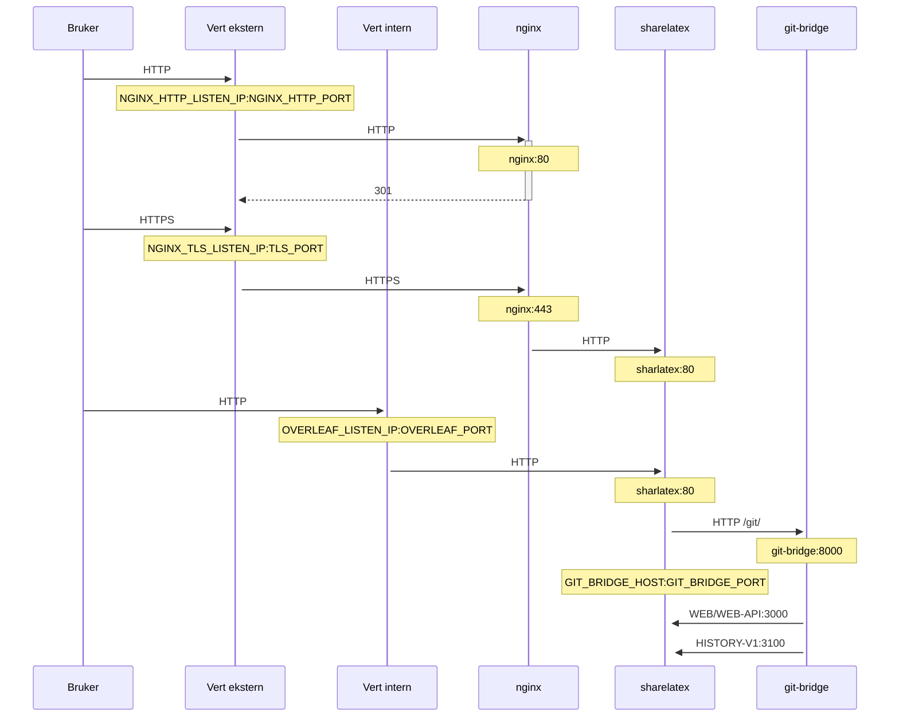

En valgfri TLS-proxy for terminering av HTTPS-tilkoblinger, basert på NGINX.

Kjør `bin/init --tls` for å initialisere lokal konfigurasjon med NGINX-proxykonfigurasjon, eller for å legge til NGINX-proxykonfigurasjon i en eksisterende lokal konfigurasjon. En privat **eksempelnøkkel** opprettes i `config/nginx/certs/overleaf_key.pem` og et **dummy**-sertifikat i `config/nginx/certs/overleaf_certificate.pem`. Du kan enten erstatte disse med din faktiske private nøkkel og ditt faktiske sertifikat, eller sette verdiene til variablene `TLS_PRIVATE_KEY_PATH` og `TLS_CERTIFICATE_PATH` til stiene for henholdsvis din faktiske private nøkkel og ditt faktiske sertifikat.

En standardkonfigurasjon for NGINX finnes i `config/nginx/nginx.conf`, og den kan tilpasses etter dine behov. Stien til konfigurasjonsfilen kan endres med variabelen `NGINX_CONFIG_PATH`.

<Check>

Hvis du har en distribusjon basert på **docker-compose.yml**, eller administrerer din egen NGINX reverse proxy, kan du se et eksempel på en **nginx.conf**-fil [her](https://github.com/overleaf/toolkit/blob/master/lib/config-seed/nginx.conf).

</Check>

Legg til følgende seksjon i filen `config/overleaf.rc` hvis den ikke allerede finnes der:

```text
# TLS proxy configuration (optional)
NGINX_ENABLED=false
NGINX_CONFIG_PATH=config/nginx/nginx.conf
NGINX_HTTP_PORT=80

# Replace these IP addresses with the external IP address of your host
NGINX_HTTP_LISTEN_IP=127.0.1.1 
NGINX_TLS_LISTEN_IP=127.0.1.1
TLS_PRIVATE_KEY_PATH=config/nginx/certs/overleaf_key.pem
TLS_CERTIFICATE_PATH=config/nginx/certs/overleaf_certificate.pem
TLS_PORT=443
```

<Danger>

Hvis du bruker en ekstern TLS-proxy (dvs. en som ikke administreres av Overleaf Toolkit), må du sørge for at `OVERLEAF_TRUSTED_PROXY_IPS=loopback,<ip-of-your-tls-proxy>` er angitt i `config/variables.env`, f.eks. `OVERLEAF_TRUSTED_PROXY_IPS=loopback,192.168.13.37`.

</Danger>

<Danger>

Hvis du bruker et subnett fra `172.16.0.0/12` (standardsubnettet for Docker-nettverk) for ditt lokale nettverk, må du angi `OVERLEAF_TRUSTED_PROXY_IPS=loopback,<network>` i `config/variables.env`. Her er `<network>` verdien `IPAM -> Config -> Subnet` i `docker inspect overleaf_default`, f.eks. `OVERLEAF_TRUSTED_PROXY_IPS=loopback,172.19.0.0/16`. Dette er for å forhindre forfalskning av `X-Forwarded`-headere.

</Danger>

<Info>

Hvis `OVERLEAF_TRUSTED_PROXY_IPS` ikke angis manuelt, er standardverdien `loopback`. Hvis du angir den manuelt, må du sørge for å inkludere `loopback` (eller `127.0.0.1`), som gir tillit til **nginx**-instansen som kjører i **sharelatex**-containeren. Bare IP-adresser og CIDR-områder godtas: ikke legg til vertsnavn som `localhost`, ellers vil Overleaf ikke starte og returnere `502 Bad Gateway`.

</Info>

Hvis du har konfigurert de klarerte proxy-IP-ene riktig, skal du se din offentlige IP-adresse på siden `/user/sessions`, slik:

<Frame>
  
</Frame>

Hvis IP-adressen som vises ovenfor fortsatt er noe som `127.0.0.1` eller en IP-adresse i et privat/lokalt nettverk, bør du kontrollere konfigurasjonen for klarerte proxyer, spesielt verdien av `OVERLEAF_TRUSTED_PROXY_IPS`.

For å kjøre proxyen endrer du verdien av variabelen `NGINX_ENABLED` i `config/overleaf.rc` fra `false` til `true` og kjører `bin/up` på nytt.

Som standard er HTTPS-nettgrensesnittet tilgjengelig på `https://127.0.1.1:443`. Tilkoblinger til `http://127.0.1.1:80` omdirigeres til `https://127.0.1.1:443`. For å endre IP-adressen som NGINX lytter på, angir du variablene `NGINX_HTTP_LISTEN_IP` og `NGINX_TLS_LISTEN_IP`. Portene kan endres via variablene `NGINX_HTTP_PORT` og `TLS_PORT`.

Hvis NGINX ikke starter og gir feilmeldingen `Error starting userland proxy: listen tcp4 ... bind: address already in use`, må du sørge for at `OVERLEAF_LISTEN_IP:OVERLEAF_PORT` ikke overlapper med `NGINX_HTTP_LISTEN_IP:NGINX_HTTP_PORT`.


