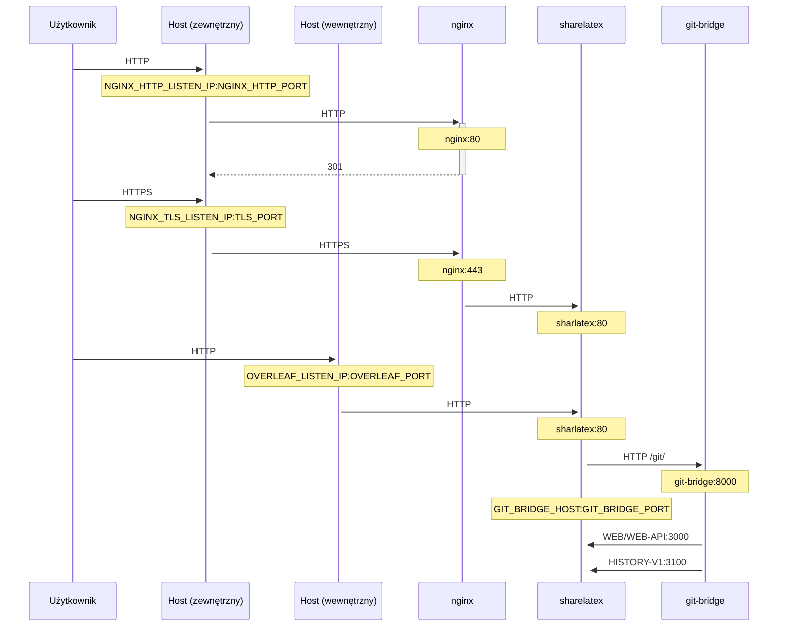

Opcjonalne proxy TLS do terminowania połączeń HTTPS, oparte na NGINX.

Uruchom `bin/init --tls`, aby zainicjować lokalną konfigurację z konfiguracją proxy NGINX lub dodać konfigurację proxy NGINX do istniejącej konfiguracji lokalnej. W `config/nginx/certs/overleaf_key.pem` tworzony jest **przykładowy** klucz prywatny, a w `config/nginx/certs/overleaf_certificate.pem` — **atrapa** certyfikatu. Zastąp je swoim rzeczywistym kluczem prywatnym i certyfikatem albo ustaw wartości zmiennych `TLS_PRIVATE_KEY_PATH` i `TLS_CERTIFICATE_PATH` odpowiednio na ścieżki do rzeczywistego klucza prywatnego i certyfikatu.

Domyślna konfiguracja NGINX znajduje się w `config/nginx/nginx.conf` i można ją dostosować do swoich potrzeb. Ścieżkę do pliku konfiguracyjnego można zmienić za pomocą zmiennej `NGINX_CONFIG_PATH`.

<Check>

Jeśli Twoje wdrożenie opiera się na **docker-compose.yml** lub zarządzasz własnym reverse proxy NGINX, przykładowy plik **nginx.conf** znajdziesz [tutaj](https://github.com/overleaf/toolkit/blob/master/lib/config-seed/nginx.conf).

</Check>

Dodaj następującą sekcję do pliku `config/overleaf.rc`, jeśli jeszcze jej tam nie ma:

```text
# TLS proxy configuration (optional)
NGINX_ENABLED=false
NGINX_CONFIG_PATH=config/nginx/nginx.conf
NGINX_HTTP_PORT=80

# Replace these IP addresses with the external IP address of your host
NGINX_HTTP_LISTEN_IP=127.0.1.1 
NGINX_TLS_LISTEN_IP=127.0.1.1
TLS_PRIVATE_KEY_PATH=config/nginx/certs/overleaf_key.pem
TLS_CERTIFICATE_PATH=config/nginx/certs/overleaf_certificate.pem
TLS_PORT=443
```

<Danger>

Jeśli korzystasz z zewnętrznego proxy TLS (tj. niezarządzanego przez Overleaf Toolkit), upewnij się, że w pliku `config/variables.env` ustawiono `OVERLEAF_TRUSTED_PROXY_IPS=loopback,<ip-of-your-tls-proxy>`, np. `OVERLEAF_TRUSTED_PROXY_IPS=loopback,192.168.13.37`.

</Danger>

<Danger>

Jeśli w swojej sieci lokalnej używasz podsieci z zakresu `172.16.0.0/12` (domyślna podsieć dla sieci Docker), musisz ustawić `OVERLEAF_TRUSTED_PROXY_IPS=loopback,<network>` w pliku `config/variables.env`, gdzie `<network>` to wartość `IPAM -> Config -> Subnet` z `docker inspect overleaf_default`, np. `OVERLEAF_TRUSTED_PROXY_IPS=loopback,172.19.0.0/16`. Ma to zapobiec podszywaniu się za pomocą nagłówków `X-Forwarded`.

</Danger>

<Info>

Jeśli `OVERLEAF_TRUSTED_PROXY_IPS` nie zostanie ustawiona ręcznie, domyślnie przyjmuje wartość `loopback`. Przy ręcznym ustawianiu musisz uwzględnić `loopback` (lub `127.0.0.1`), co oznacza zaufanie do instancji **nginx** działającej w kontenerze **sharelatex**. Akceptowane są tylko adresy IP i zakresy CIDR: nie dodawaj nazw hostów, takich jak `localhost`, w przeciwnym razie Overleaf nie uruchomi się i zwróci `502 Bad Gateway`.

</Info>

Jeśli poprawnie skonfigurowałeś zaufane adresy IP proxy, na stronie `/user/sessions` powinieneś zobaczyć swój publiczny adres IP, tak jak tutaj:

<Frame>
  
</Frame>

Jeśli powyżej nadal wyświetla się adres podobny do `127.0.0.1` lub adres IP sieci prywatnej/lokalnej, sprawdź konfigurację zaufanych proxy, w szczególności wartość `OVERLEAF_TRUSTED_PROXY_IPS`.

Aby uruchomić proxy, zmień wartość zmiennej `NGINX_ENABLED` w `config/overleaf.rc` z `false` na `true` i ponownie uruchom `bin/up`.

Domyślnie interfejs webowy HTTPS będzie dostępny pod adresem `https://127.0.1.1:443`. Połączenia z `http://127.0.1.1:80` będą przekierowywane na `https://127.0.1.1:443`. Aby zmienić adres IP, na którym nasłuchuje NGINX, ustaw zmienne `NGINX_HTTP_LISTEN_IP` i `NGINX_TLS_LISTEN_IP`. Porty można zmienić za pomocą zmiennych `NGINX_HTTP_PORT` i `TLS_PORT`.

Jeśli NGINX nie uruchamia się i zgłasza błąd `Error starting userland proxy: listen tcp4 ... bind: address already in use`, upewnij się, że `OVERLEAF_LISTEN_IP:OVERLEAF_PORT` nie pokrywa się z `NGINX_HTTP_LISTEN_IP:NGINX_HTTP_PORT`.


