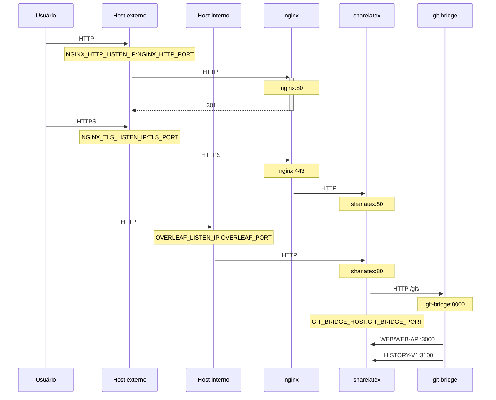

Um proxy TLS opcional para terminar conexões HTTPS, usando NGINX.

Execute `bin/init --tls` para inicializar a configuração local com a configuração de proxy NGINX, ou para adicionar a configuração de proxy NGINX a uma configuração local existente. Uma chave privada de **exemplo** é criada em `config/nginx/certs/overleaf_key.pem` e um certificado **fictício** em `config/nginx/certs/overleaf_certificate.pem`. Substitua-os pela sua chave privada e certificado reais, ou defina os valores das variáveis `TLS_PRIVATE_KEY_PATH` e `TLS_CERTIFICATE_PATH` com os caminhos da sua chave privada e do seu certificado reais, respectivamente.

Uma configuração padrão do NGINX é fornecida em `config/nginx/nginx.conf`, que pode ser personalizada conforme suas necessidades. O caminho do arquivo de configuração pode ser alterado com a variável `NGINX_CONFIG_PATH`.

<Check>

Se você tem uma implantação baseada em **docker-compose.yml**, ou gerencia seu próprio proxy reverso NGINX, pode ver um exemplo de arquivo **nginx.conf** [aqui](https://github.com/overleaf/toolkit/blob/master/lib/config-seed/nginx.conf).

</Check>

Adicione a seguinte seção ao seu arquivo `config/overleaf.rc`, caso ainda não esteja presente:

```text
# TLS proxy configuration (optional)
NGINX_ENABLED=false
NGINX_CONFIG_PATH=config/nginx/nginx.conf
NGINX_HTTP_PORT=80

# Replace these IP addresses with the external IP address of your host
NGINX_HTTP_LISTEN_IP=127.0.1.1 
NGINX_TLS_LISTEN_IP=127.0.1.1
TLS_PRIVATE_KEY_PATH=config/nginx/certs/overleaf_key.pem
TLS_CERTIFICATE_PATH=config/nginx/certs/overleaf_certificate.pem
TLS_PORT=443
```

<Danger>

Se você estiver usando um proxy TLS externo (ou seja, não gerenciado pelo Overleaf Toolkit), certifique-se de que `OVERLEAF_TRUSTED_PROXY_IPS=loopback,<ip-of-your-tls-proxy>` esteja definido no seu `config/variables.env`, por exemplo, `OVERLEAF_TRUSTED_PROXY_IPS=loopback,192.168.13.37`.

</Danger>

<Danger>

Se você estiver usando uma sub-rede de `172.16.0.0/12` (sub-rede padrão das redes Docker) na sua rede local, será necessário definir `OVERLEAF_TRUSTED_PROXY_IPS=loopback,<network>` no seu `config/variables.env`, onde `<network>` é o valor de `IPAM -> Config -> Subnet` em `docker inspect overleaf_default`, por exemplo, `OVERLEAF_TRUSTED_PROXY_IPS=loopback,172.19.0.0/16`. Isso serve para evitar a falsificação dos cabeçalhos `X-Forwarded`.

</Danger>

<Info>

Se `OVERLEAF_TRUSTED_PROXY_IPS` não for definido manualmente, o padrão é `loopback`. Ao defini-lo manualmente, você deve garantir que inclui `loopback` (ou `127.0.0.1`), o que confia na instância do **nginx** em execução dentro do contêiner **sharelatex**. Apenas endereços IP e faixas CIDR são aceitos: não adicione nomes de host como `localhost`, caso contrário o Overleaf não iniciará e retornará `502 Bad Gateway`.

</Info>

Se você configurou corretamente os IPs de proxy confiáveis, deverá ver seu endereço IP público na página `/user/sessions`, assim:

<Frame>
  
</Frame>

Se o endereço IP mostrado acima ainda for algo como `127.0.0.1` ou um endereço IP de rede privada/local, verifique sua configuração de proxy confiável, especialmente o valor de `OVERLEAF_TRUSTED_PROXY_IPS`.

Para executar o proxy, altere o valor da variável `NGINX_ENABLED` em `config/overleaf.rc` de `false` para `true` e execute `bin/up` novamente.

Por padrão, a interface web HTTPS estará disponível em `https://127.0.1.1:443`. Conexões para `http://127.0.1.1:80` serão redirecionadas para `https://127.0.1.1:443`. Para alterar o endereço IP em que o NGINX escuta, defina as variáveis `NGINX_HTTP_LISTEN_IP` e `NGINX_TLS_LISTEN_IP`. As portas podem ser alteradas por meio das variáveis `NGINX_HTTP_PORT` e `TLS_PORT`.

Se o NGINX não iniciar com a mensagem de erro `Error starting userland proxy: listen tcp4 ... bind: address already in use`, verifique se `OVERLEAF_LISTEN_IP:OVERLEAF_PORT` não se sobrepõe a `NGINX_HTTP_LISTEN_IP:NGINX_HTTP_PORT`.


