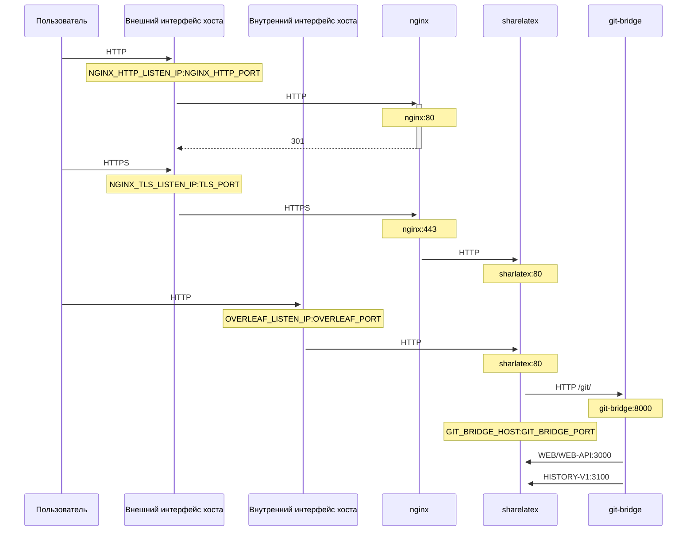

Необязательный TLS-прокси на базе NGINX для терминирования HTTPS-соединений.

Выполните `bin/init --tls`, чтобы инициализировать локальную конфигурацию с настройками прокси NGINX или добавить настройки прокси NGINX в уже существующую локальную конфигурацию. В `config/nginx/certs/overleaf_key.pem` создаётся **образец** закрытого ключа, а в `config/nginx/certs/overleaf_certificate.pem` — **фиктивный** сертификат. Либо замените их своими настоящими закрытым ключом и сертификатом, либо укажите пути к ним в переменных `TLS_PRIVATE_KEY_PATH` и `TLS_CERTIFICATE_PATH` соответственно.

Конфигурация NGINX по умолчанию находится в `config/nginx/nginx.conf`, и её можно адаптировать под свои требования. Путь к файлу конфигурации можно изменить с помощью переменной `NGINX_CONFIG_PATH`.

<Check>

Если ваше развёртывание основано на **docker-compose.yml** или вы управляете собственным обратным прокси NGINX, пример файла **nginx.conf** можно посмотреть [здесь](https://github.com/overleaf/toolkit/blob/master/lib/config-seed/nginx.conf).

</Check>

Добавьте следующий раздел в файл `config/overleaf.rc`, если его там ещё нет:

```text
# TLS proxy configuration (optional)
NGINX_ENABLED=false
NGINX_CONFIG_PATH=config/nginx/nginx.conf
NGINX_HTTP_PORT=80

# Replace these IP addresses with the external IP address of your host
NGINX_HTTP_LISTEN_IP=127.0.1.1 
NGINX_TLS_LISTEN_IP=127.0.1.1
TLS_PRIVATE_KEY_PATH=config/nginx/certs/overleaf_key.pem
TLS_CERTIFICATE_PATH=config/nginx/certs/overleaf_certificate.pem
TLS_PORT=443
```

<Danger>

Если вы используете внешний TLS-прокси (то есть не управляемый Overleaf Toolkit), убедитесь, что в файле `config/variables.env` задано `OVERLEAF_TRUSTED_PROXY_IPS=loopback,<ip-of-your-tls-proxy>`, например `OVERLEAF_TRUSTED_PROXY_IPS=loopback,192.168.13.37`.

</Danger>

<Danger>

Если для локальной сети вы используете подсеть из диапазона `172.16.0.0/12` (подсеть по умолчанию для сетей Docker), необходимо задать `OVERLEAF_TRUSTED_PROXY_IPS=loopback,<network>` в файле `config/variables.env`, где `<network>` — значение `IPAM -> Config -> Subnet` из вывода `docker inspect overleaf_default`, например `OVERLEAF_TRUSTED_PROXY_IPS=loopback,172.19.0.0/16`. Это нужно для предотвращения подделки заголовков `X-Forwarded`.

</Danger>

<Info>

Если `OVERLEAF_TRUSTED_PROXY_IPS` не задана вручную, по умолчанию используется значение `loopback`. При ручной настройке обязательно включите `loopback` (или `127.0.0.1`) — это обеспечивает доверие к экземпляру **nginx**, работающему внутри контейнера **sharelatex**. Допускаются только IP-адреса и диапазоны CIDR: не добавляйте имена хостов, например `localhost`, иначе Overleaf не запустится и будет возвращать `502 Bad Gateway`.

</Info>

Если доверенные IP-адреса прокси настроены правильно, на странице `/user/sessions` должен отображаться ваш публичный IP-адрес, например так:

<Frame>
  
</Frame>

Если показанный выше IP-адрес по-прежнему имеет вид `127.0.0.1` или является адресом частной/локальной сети, проверьте настройки доверенных прокси, особенно значение `OVERLEAF_TRUSTED_PROXY_IPS`.

Чтобы запустить прокси, измените значение переменной `NGINX_ENABLED` в `config/overleaf.rc` с `false` на `true` и снова выполните `bin/up`.

По умолчанию веб-интерфейс HTTPS будет доступен по адресу `https://127.0.1.1:443`. Соединения с `http://127.0.1.1:80` будут перенаправляться на `https://127.0.1.1:443`. Чтобы изменить IP-адрес, который прослушивает NGINX, задайте переменные `NGINX_HTTP_LISTEN_IP` и `NGINX_TLS_LISTEN_IP`. Порты можно изменить с помощью переменных `NGINX_HTTP_PORT` и `TLS_PORT`.

Если NGINX не запускается с сообщением об ошибке `Error starting userland proxy: listen tcp4 ... bind: address already in use`, убедитесь, что `OVERLEAF_LISTEN_IP:OVERLEAF_PORT` не пересекается с `NGINX_HTTP_LISTEN_IP:NGINX_HTTP_PORT`.


