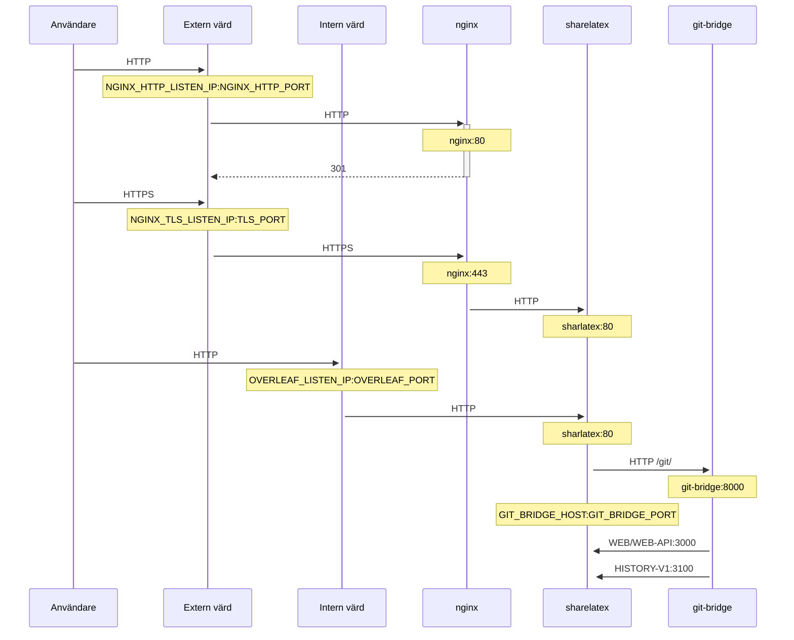

En valfri TLS-proxy för att terminera HTTPS-anslutningar, med NGINX.

Kör `bin/init --tls` för att initiera den lokala konfigurationen med NGINX-proxykonfiguration, eller för att lägga till NGINX-proxykonfiguration i en befintlig lokal konfiguration. En privat **exempelnyckel** skapas i `config/nginx/certs/overleaf_key.pem` och ett **dummycertifikat** i `config/nginx/certs/overleaf_certificate.pem`. Ersätt antingen dessa med din faktiska privata nyckel och ditt certifikat, eller ange värdena för variablerna `TLS_PRIVATE_KEY_PATH` och `TLS_CERTIFICATE_PATH` till sökvägarna för din faktiska privata nyckel respektive ditt certifikat.

En standardkonfiguration för NGINX finns i `config/nginx/nginx.conf` och kan anpassas efter dina behov. Sökvägen till konfigurationsfilen kan ändras med variabeln `NGINX_CONFIG_PATH`.

<Check>

Om du har en driftsättning baserad på **docker-compose.yml**, eller hanterar din egen NGINX-omvända proxy, kan du se ett exempel på en **nginx.conf**-fil [här](https://github.com/overleaf/toolkit/blob/master/lib/config-seed/nginx.conf).

</Check>

Lägg till följande avsnitt i din fil `config/overleaf.rc` om det inte redan finns där:

```text
# TLS proxy configuration (optional)
NGINX_ENABLED=false
NGINX_CONFIG_PATH=config/nginx/nginx.conf
NGINX_HTTP_PORT=80

# Replace these IP addresses with the external IP address of your host
NGINX_HTTP_LISTEN_IP=127.0.1.1 
NGINX_TLS_LISTEN_IP=127.0.1.1
TLS_PRIVATE_KEY_PATH=config/nginx/certs/overleaf_key.pem
TLS_CERTIFICATE_PATH=config/nginx/certs/overleaf_certificate.pem
TLS_PORT=443
```

<Danger>

Om du använder en extern TLS-proxy (dvs. en som inte hanteras av Overleaf Toolkit), se till att `OVERLEAF_TRUSTED_PROXY_IPS=loopback,<ip-of-your-tls-proxy>` är inställt i din `config/variables.env`, t.ex. `OVERLEAF_TRUSTED_PROXY_IPS=loopback,192.168.13.37`.

</Danger>

<Danger>

Om du använder ett subnät från `172.16.0.0/12` (standardsubnätet för Docker-nätverk) för ditt lokala nätverk måste du ange `OVERLEAF_TRUSTED_PROXY_IPS=loopback,<network>` i din `config/variables.env`, där `<network>` är värdet `IPAM -> Config -> Subnet` i `docker inspect overleaf_default`, t.ex. `OVERLEAF_TRUSTED_PROXY_IPS=loopback,172.19.0.0/16`. Detta förhindrar förfalskning av `X-Forwarded`-huvuden.

</Danger>

<Info>

Om `OVERLEAF_TRUSTED_PROXY_IPS` inte anges manuellt är standardvärdet `loopback`. Om du anger det manuellt måste du se till att inkludera `loopback` (eller `127.0.0.1`), vilket gör att **nginx**-instansen som körs inuti **sharelatex**-containern betraktas som betrodd. Endast IP-adresser och CIDR-intervall accepteras: lägg inte till värdnamn som `localhost`, annars startar inte Overleaf och returnerar `502 Bad Gateway`.

</Info>

Om du har konfigurerat de betrodda proxy-IP-adresserna korrekt bör du se din publika IP-adress på sidan `/user/sessions`, så här:

<Frame>
  
</Frame>

Om IP-adressen som visas ovan fortfarande är något i stil med `127.0.0.1` eller en privat/lokal nätverks-IP-adress, kontrollera din konfiguration av betrodda proxyer, särskilt värdet för `OVERLEAF_TRUSTED_PROXY_IPS`.

För att köra proxyn, ändra värdet för variabeln `NGINX_ENABLED` i `config/overleaf.rc` från `false` till `true` och kör `bin/up` igen.

Som standard är HTTPS-webbgränssnittet tillgängligt på `https://127.0.1.1:443`. Anslutningar till `http://127.0.1.1:80` omdirigeras till `https://127.0.1.1:443`. För att ändra IP-adressen som NGINX lyssnar på, ange variablerna `NGINX_HTTP_LISTEN_IP` och `NGINX_TLS_LISTEN_IP`. Portarna kan ändras via variablerna `NGINX_HTTP_PORT` och `TLS_PORT`.

Om NGINX inte startar och felmeddelandet `Error starting userland proxy: listen tcp4 ... bind: address already in use` visas, se till att `OVERLEAF_LISTEN_IP:OVERLEAF_PORT` inte överlappar med `NGINX_HTTP_LISTEN_IP:NGINX_HTTP_PORT`.


