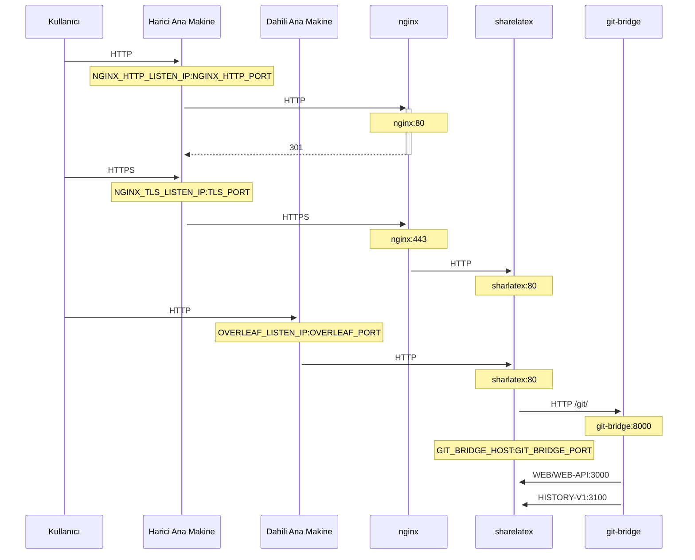

HTTPS bağlantılarını sonlandırmak için NGINX kullanan isteğe bağlı bir TLS proxy.

Yerel yapılandırmayı NGINX proxy yapılandırmasıyla başlatmak veya mevcut bir yerel yapılandırmaya NGINX proxy yapılandırması eklemek için `bin/init --tls` komutunu çalıştırın. `config/nginx/certs/overleaf_key.pem` konumunda **örnek** bir özel anahtar ve `config/nginx/certs/overleaf_certificate.pem` konumunda **sahte** bir sertifika oluşturulur. Bunları gerçek özel anahtarınız ve sertifikanızla değiştirin ya da `TLS_PRIVATE_KEY_PATH` ve `TLS_CERTIFICATE_PATH` değişkenlerinin değerlerini sırasıyla gerçek özel anahtarınızın ve sertifikanızın yollarına ayarlayın.

NGINX için `config/nginx/nginx.conf` konumunda, gereksinimlerinize göre özelleştirilebilen varsayılan bir yapılandırma sağlanır. Yapılandırma dosyasının yolu `NGINX_CONFIG_PATH` değişkeniyle değiştirilebilir.

<Check>

**docker-compose.yml** tabanlı bir kurulumunuz varsa veya kendi NGINX ters proxy'nizi yönetiyorsanız, örnek bir **nginx.conf** dosyasını [burada](https://github.com/overleaf/toolkit/blob/master/lib/config-seed/nginx.conf) görüntüleyebilirsiniz.

</Check>

Henüz yoksa aşağıdaki bölümü `config/overleaf.rc` dosyanıza ekleyin:

```text
# TLS proxy configuration (optional)
NGINX_ENABLED=false
NGINX_CONFIG_PATH=config/nginx/nginx.conf
NGINX_HTTP_PORT=80

# Replace these IP addresses with the external IP address of your host
NGINX_HTTP_LISTEN_IP=127.0.1.1 
NGINX_TLS_LISTEN_IP=127.0.1.1
TLS_PRIVATE_KEY_PATH=config/nginx/certs/overleaf_key.pem
TLS_CERTIFICATE_PATH=config/nginx/certs/overleaf_certificate.pem
TLS_PORT=443
```

<Danger>

Harici bir TLS proxy (yani Overleaf Toolkit tarafından yönetilmeyen) kullanıyorsanız, `config/variables.env` dosyanızda `OVERLEAF_TRUSTED_PROXY_IPS=loopback,<ip-of-your-tls-proxy>` ayarının yapıldığından emin olun; örneğin `OVERLEAF_TRUSTED_PROXY_IPS=loopback,192.168.13.37`.

</Danger>

<Danger>

Yerel ağınız için `172.16.0.0/12` aralığından (Docker ağlarının varsayılan alt ağı) bir alt ağ kullanıyorsanız, `config/variables.env` dosyanızda `OVERLEAF_TRUSTED_PROXY_IPS=loopback,<network>` ayarını yapmanız gerekir. Burada `<network>`, `docker inspect overleaf_default` çıktısındaki `IPAM -> Config -> Subnet` değeridir; örneğin `OVERLEAF_TRUSTED_PROXY_IPS=loopback,172.19.0.0/16`. Bu, `X-Forwarded` başlıklarının sahteciliğini önlemek içindir.

</Danger>

<Info>

`OVERLEAF_TRUSTED_PROXY_IPS` elle ayarlanmazsa varsayılan değeri `loopback`'tir. Elle ayarlıyorsanız, **sharelatex** kapsayıcısının içinde çalışan **nginx** örneğine güvenen `loopback` (veya `127.0.0.1`) değerini dahil ettiğinizden emin olmalısınız. Yalnızca IP adresleri ve CIDR aralıkları kabul edilir: `localhost` gibi ana makine adları eklemeyin, aksi takdirde Overleaf başlatılamaz ve `502 Bad Gateway` döndürür.

</Info>

Güvenilir proxy IP'lerini doğru yapılandırdıysanız, `/user/sessions` sayfasında genel IP adresinizi şu şekilde görmelisiniz:

<Frame>
  
</Frame>

Yukarıda gösterilen IP adresi hâlâ `127.0.0.1` gibi bir adres veya özel/yerel ağ IP adresiyse, lütfen güvenilir proxy yapılandırmanızı, özellikle `OVERLEAF_TRUSTED_PROXY_IPS` değerini kontrol edin.

Proxy'yi çalıştırmak için `config/overleaf.rc` dosyasındaki `NGINX_ENABLED` değişkeninin değerini `false`'tan `true`'ya değiştirin ve `bin/up` komutunu yeniden çalıştırın.

Varsayılan olarak HTTPS web arayüzü `https://127.0.1.1:443` adresinde kullanılabilir olacaktır. `http://127.0.1.1:80` adresine yapılan bağlantılar `https://127.0.1.1:443` adresine yönlendirilir. NGINX'in dinlediği IP adresini değiştirmek için `NGINX_HTTP_LISTEN_IP` ve `NGINX_TLS_LISTEN_IP` değişkenlerini ayarlayın. Portlar `NGINX_HTTP_PORT` ve `TLS_PORT` değişkenleriyle değiştirilebilir.

NGINX `Error starting userland proxy: listen tcp4 ... bind: address already in use` hata mesajıyla başlatılamazsa, `OVERLEAF_LISTEN_IP:OVERLEAF_PORT` ile `NGINX_HTTP_LISTEN_IP:NGINX_HTTP_PORT` değerlerinin çakışmadığından emin olun.


