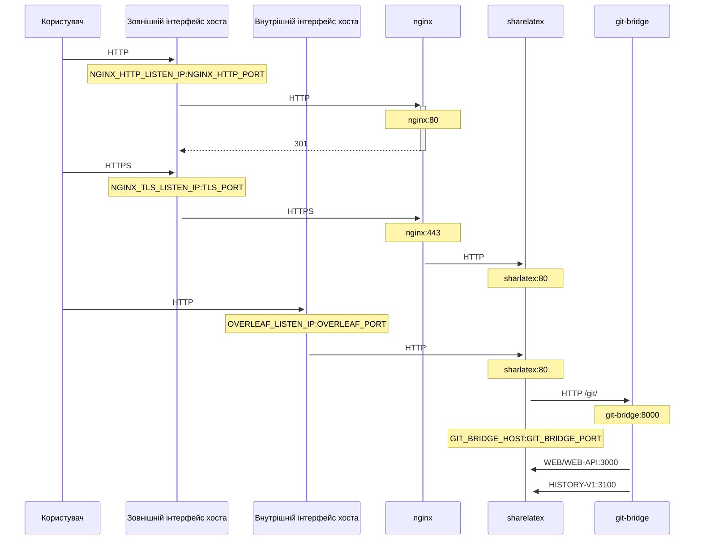

Необов'язковий TLS-проксі на основі NGINX для термінації HTTPS-з'єднань.

Виконайте `bin/init --tls`, щоб ініціалізувати локальну конфігурацію з налаштуваннями проксі NGINX або додати налаштування проксі NGINX до наявної локальної конфігурації. У файлі `config/nginx/certs/overleaf_key.pem` буде створено **зразок** приватного ключа, а у файлі `config/nginx/certs/overleaf_certificate.pem` — **фіктивний** сертифікат. Замініть їх своїми справжніми приватним ключем і сертифікатом або задайте у змінних `TLS_PRIVATE_KEY_PATH` і `TLS_CERTIFICATE_PATH` шляхи до вашого справжнього приватного ключа та сертифіката відповідно.

Типову конфігурацію NGINX надано у файлі `config/nginx/nginx.conf`; її можна змінити відповідно до ваших потреб. Шлях до файлу конфігурації можна змінити за допомогою змінної `NGINX_CONFIG_PATH`.

<Check>

Якщо ваше розгортання базується на **docker-compose.yml** або ви керуєте власним зворотним проксі NGINX, приклад файлу **nginx.conf** можна переглянути [тут](https://github.com/overleaf/toolkit/blob/master/lib/config-seed/nginx.conf).

</Check>

Додайте такий розділ до файлу `config/overleaf.rc`, якщо його там ще немає:

```text
# TLS proxy configuration (optional)
NGINX_ENABLED=false
NGINX_CONFIG_PATH=config/nginx/nginx.conf
NGINX_HTTP_PORT=80

# Replace these IP addresses with the external IP address of your host
NGINX_HTTP_LISTEN_IP=127.0.1.1 
NGINX_TLS_LISTEN_IP=127.0.1.1
TLS_PRIVATE_KEY_PATH=config/nginx/certs/overleaf_key.pem
TLS_CERTIFICATE_PATH=config/nginx/certs/overleaf_certificate.pem
TLS_PORT=443
```

<Danger>

Якщо ви використовуєте зовнішній TLS-проксі (тобто такий, яким не керує Overleaf Toolkit), переконайтеся, що у вашому `config/variables.env` задано `OVERLEAF_TRUSTED_PROXY_IPS=loopback,<ip-of-your-tls-proxy>`, наприклад `OVERLEAF_TRUSTED_PROXY_IPS=loopback,192.168.13.37`.

</Danger>

<Danger>

Якщо для вашої локальної мережі використовується підмережа з діапазону `172.16.0.0/12` (типова підмережа для мереж Docker), потрібно задати `OVERLEAF_TRUSTED_PROXY_IPS=loopback,<network>` у вашому `config/variables.env`, де `<network>` — це значення `IPAM -> Config -> Subnet` з виводу `docker inspect overleaf_default`, наприклад `OVERLEAF_TRUSTED_PROXY_IPS=loopback,172.19.0.0/16`. Це потрібно для запобігання підробці заголовків `X-Forwarded`.

</Danger>

<Info>

Якщо `OVERLEAF_TRUSTED_PROXY_IPS` не задано вручну, типовим значенням є `loopback`. Якщо ви задаєте його вручну, обов'язково включіть `loopback` (або `127.0.0.1`), що забезпечує довіру до екземпляра **nginx**, який працює всередині контейнера **sharelatex**. Приймаються лише IP-адреси та діапазони CIDR: не додавайте імена хостів, як-от `localhost`, інакше Overleaf не запуститься й повертатиме `502 Bad Gateway`.

</Info>

Якщо ви правильно налаштували IP-адреси довірених проксі, на сторінці `/user/sessions` ви побачите свою публічну IP-адресу, як тут:

<Frame>
  
</Frame>

Якщо показана вище IP-адреса все ще має вигляд `127.0.0.1` або є адресою приватної/локальної мережі, перевірте конфігурацію довірених проксі, особливо значення `OVERLEAF_TRUSTED_PROXY_IPS`.

Щоб запустити проксі, змініть значення змінної `NGINX_ENABLED` у `config/overleaf.rc` з `false` на `true` і повторно виконайте `bin/up`.

Типово вебінтерфейс HTTPS буде доступний за адресою `https://127.0.1.1:443`. З'єднання з `http://127.0.1.1:80` будуть перенаправлятися на `https://127.0.1.1:443`. Щоб змінити IP-адресу, яку прослуховує NGINX, задайте змінні `NGINX_HTTP_LISTEN_IP` і `NGINX_TLS_LISTEN_IP`. Порти можна змінити за допомогою змінних `NGINX_HTTP_PORT` і `TLS_PORT`.

Якщо NGINX не запускається з повідомленням про помилку `Error starting userland proxy: listen tcp4 ... bind: address already in use`, переконайтеся, що `OVERLEAF_LISTEN_IP:OVERLEAF_PORT` не перетинається з `NGINX_HTTP_LISTEN_IP:NGINX_HTTP_PORT`.


