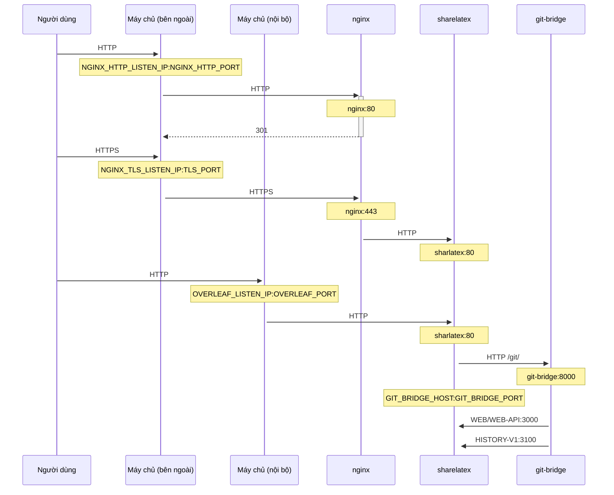

Một proxy TLS tùy chọn để kết thúc (terminate) các kết nối HTTPS, sử dụng NGINX.

Chạy `bin/init --tls` để khởi tạo cấu hình cục bộ kèm cấu hình proxy NGINX, hoặc để thêm cấu hình proxy NGINX vào một cấu hình cục bộ hiện có. Một khóa riêng tư **mẫu** sẽ được tạo tại `config/nginx/certs/overleaf_key.pem` và một chứng chỉ **giả** tại `config/nginx/certs/overleaf_certificate.pem`. Hãy thay thế chúng bằng khóa riêng tư và chứng chỉ thực của bạn, hoặc đặt giá trị của các biến `TLS_PRIVATE_KEY_PATH` và `TLS_CERTIFICATE_PATH` lần lượt thành đường dẫn đến khóa riêng tư và chứng chỉ thực của bạn.

Một cấu hình mặc định cho NGINX được cung cấp tại `config/nginx/nginx.conf`, bạn có thể tùy chỉnh theo nhu cầu. Đường dẫn đến tệp cấu hình có thể được thay đổi bằng biến `NGINX_CONFIG_PATH`.

<Check>

Nếu bạn triển khai dựa trên **docker-compose.yml**, hoặc tự quản lý reverse proxy NGINX của riêng mình, bạn có thể xem một tệp **nginx.conf** mẫu [tại đây](https://github.com/overleaf/toolkit/blob/master/lib/config-seed/nginx.conf).

</Check>

Thêm phần sau vào tệp `config/overleaf.rc` nếu chưa có:

```text
# TLS proxy configuration (optional)
NGINX_ENABLED=false
NGINX_CONFIG_PATH=config/nginx/nginx.conf
NGINX_HTTP_PORT=80

# Replace these IP addresses with the external IP address of your host
NGINX_HTTP_LISTEN_IP=127.0.1.1 
NGINX_TLS_LISTEN_IP=127.0.1.1
TLS_PRIVATE_KEY_PATH=config/nginx/certs/overleaf_key.pem
TLS_CERTIFICATE_PATH=config/nginx/certs/overleaf_certificate.pem
TLS_PORT=443
```

<Danger>

Nếu bạn đang sử dụng một proxy TLS bên ngoài (tức là không do Overleaf Toolkit quản lý), hãy đảm bảo rằng `OVERLEAF_TRUSTED_PROXY_IPS=loopback,<ip-of-your-tls-proxy>` đã được đặt trong `config/variables.env`, ví dụ: `OVERLEAF_TRUSTED_PROXY_IPS=loopback,192.168.13.37`.

</Danger>

<Danger>

Nếu mạng cục bộ của bạn sử dụng một subnet thuộc `172.16.0.0/12` (subnet mặc định cho các mạng Docker), bạn cần đặt `OVERLEAF_TRUSTED_PROXY_IPS=loopback,<network>` trong `config/variables.env`. Trong đó `<network>` là giá trị `IPAM -> Config -> Subnet` trong kết quả của `docker inspect overleaf_default`, ví dụ: `OVERLEAF_TRUSTED_PROXY_IPS=loopback,172.19.0.0/16`. Điều này nhằm ngăn chặn việc giả mạo các header `X-Forwarded`.

</Danger>

<Info>

Nếu `OVERLEAF_TRUSTED_PROXY_IPS` không được đặt thủ công, giá trị mặc định là `loopback`. Nếu đặt thủ công, bạn phải đảm bảo có bao gồm `loopback` (hoặc `127.0.0.1`), giá trị này tin cậy phiên bản **nginx** chạy bên trong container **sharelatex**. Chỉ chấp nhận địa chỉ IP và dải CIDR: không thêm tên máy chủ như `localhost`, nếu không Overleaf sẽ không khởi động được và trả về `502 Bad Gateway`.

</Info>

Nếu bạn đã cấu hình đúng các IP proxy tin cậy, bạn sẽ thấy địa chỉ IP công khai của mình trên trang `/user/sessions` như sau:

<Frame>
  
</Frame>

Nếu địa chỉ IP hiển thị ở trên vẫn là dạng `127.0.0.1` hoặc một địa chỉ IP mạng riêng/cục bộ, vui lòng kiểm tra lại cấu hình proxy tin cậy, đặc biệt là giá trị của `OVERLEAF_TRUSTED_PROXY_IPS`.

Để chạy proxy, hãy thay đổi giá trị của biến `NGINX_ENABLED` trong `config/overleaf.rc` từ `false` thành `true` và chạy lại `bin/up`.

Theo mặc định, giao diện web HTTPS sẽ khả dụng tại `https://127.0.1.1:443`. Các kết nối đến `http://127.0.1.1:80` sẽ được chuyển hướng đến `https://127.0.1.1:443`. Để thay đổi địa chỉ IP mà NGINX lắng nghe, hãy đặt các biến `NGINX_HTTP_LISTEN_IP` và `NGINX_TLS_LISTEN_IP`. Các cổng có thể được thay đổi thông qua các biến `NGINX_HTTP_PORT` và `TLS_PORT`.

Nếu NGINX không khởi động được với thông báo lỗi `Error starting userland proxy: listen tcp4 ... bind: address already in use`, hãy đảm bảo rằng `OVERLEAF_LISTEN_IP:OVERLEAF_PORT` không trùng với `NGINX_HTTP_LISTEN_IP:NGINX_HTTP_PORT`.


