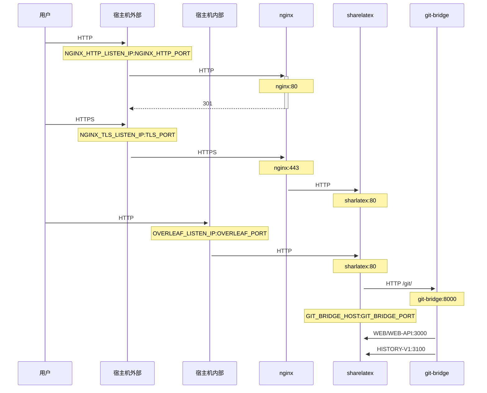

一个可选的 TLS 代理，使用 NGINX 终止 HTTPS 连接。

运行 `bin/init --tls` 以使用 NGINX 代理配置初始化本地配置，或将 NGINX 代理配置添加到现有的本地配置中。系统会在 `config/nginx/certs/overleaf_key.pem` 中创建一个**示例**私钥，并在 `config/nginx/certs/overleaf_certificate.pem` 中创建一个**虚拟**证书。你可以将它们替换为实际的私钥和证书，或者将 `TLS_PRIVATE_KEY_PATH` 和 `TLS_CERTIFICATE_PATH` 变量的值分别设置为实际私钥和证书的路径。

`config/nginx/nginx.conf` 中提供了 NGINX 的默认配置，你可以根据需要进行自定义。配置文件的路径可以通过 `NGINX_CONFIG_PATH` 变量更改。

<Check>

如果你使用的是基于 **docker-compose.yml** 的部署，或自行管理 NGINX 反向代理，可以在[这里](https://github.com/overleaf/toolkit/blob/master/lib/config-seed/nginx.conf)查看 **nginx.conf** 示例文件。

</Check>

如果 `config/overleaf.rc` 文件中还没有以下部分，请添加：

```text
# TLS proxy configuration (optional)
NGINX_ENABLED=false
NGINX_CONFIG_PATH=config/nginx/nginx.conf
NGINX_HTTP_PORT=80

# Replace these IP addresses with the external IP address of your host
NGINX_HTTP_LISTEN_IP=127.0.1.1 
NGINX_TLS_LISTEN_IP=127.0.1.1
TLS_PRIVATE_KEY_PATH=config/nginx/certs/overleaf_key.pem
TLS_CERTIFICATE_PATH=config/nginx/certs/overleaf_certificate.pem
TLS_PORT=443
```

<Danger>

如果你使用的是外部 TLS 代理（即不由 Overleaf Toolkit 管理），请确保在 `config/variables.env` 中设置了 `OVERLEAF_TRUSTED_PROXY_IPS=loopback,<ip-of-your-tls-proxy>`，例如 `OVERLEAF_TRUSTED_PROXY_IPS=loopback,192.168.13.37`。

</Danger>

<Danger>

如果你的本地网络使用的是 `172.16.0.0/12`（Docker 网络的默认子网）中的子网，你需要在 `config/variables.env` 中设置 `OVERLEAF_TRUSTED_PROXY_IPS=loopback,<network>`。其中 `<network>` 是 `docker inspect overleaf_default` 中 `IPAM -> Config -> Subnet` 的值，例如 `OVERLEAF_TRUSTED_PROXY_IPS=loopback,172.19.0.0/16`。这是为了防止 `X-Forwarded` 请求头被伪造。

</Danger>

<Info>

如果未手动设置 `OVERLEAF_TRUSTED_PROXY_IPS`，其默认值为 `loopback`。如果手动设置，你必须确保包含 `loopback`（或 `127.0.0.1`），以信任运行在 **sharelatex** 容器内的 **nginx** 实例。只接受 IP 地址和 CIDR 范围：不要添加 `localhost` 之类的主机名，否则 Overleaf 将无法启动并返回 `502 Bad Gateway`。

</Info>

如果你正确配置了受信任的代理 IP，应该能在 `/user/sessions` 页面上看到你的公网 IP 地址，如下所示：

<Frame>
  
</Frame>

如果上面显示的 IP 地址仍然是 `127.0.0.1` 或私有/本地网络 IP 地址之类的值，请检查你的受信任代理配置，尤其是 `OVERLEAF_TRUSTED_PROXY_IPS` 的值。

要运行代理，请将 `config/overleaf.rc` 中 `NGINX_ENABLED` 变量的值从 `false` 改为 `true`，然后重新运行 `bin/up`。

默认情况下，HTTPS Web 界面可通过 `https://127.0.1.1:443` 访问。对 `http://127.0.1.1:80` 的连接将被重定向到 `https://127.0.1.1:443`。要更改 NGINX 监听的 IP 地址，请设置 `NGINX_HTTP_LISTEN_IP` 和 `NGINX_TLS_LISTEN_IP` 变量。端口可以通过 `NGINX_HTTP_PORT` 和 `TLS_PORT` 变量更改。

如果 NGINX 启动失败并显示错误信息 `Error starting userland proxy: listen tcp4 ... bind: address already in use`，请确保 `OVERLEAF_LISTEN_IP:OVERLEAF_PORT` 与 `NGINX_HTTP_LISTEN_IP:NGINX_HTTP_PORT` 不重叠。


