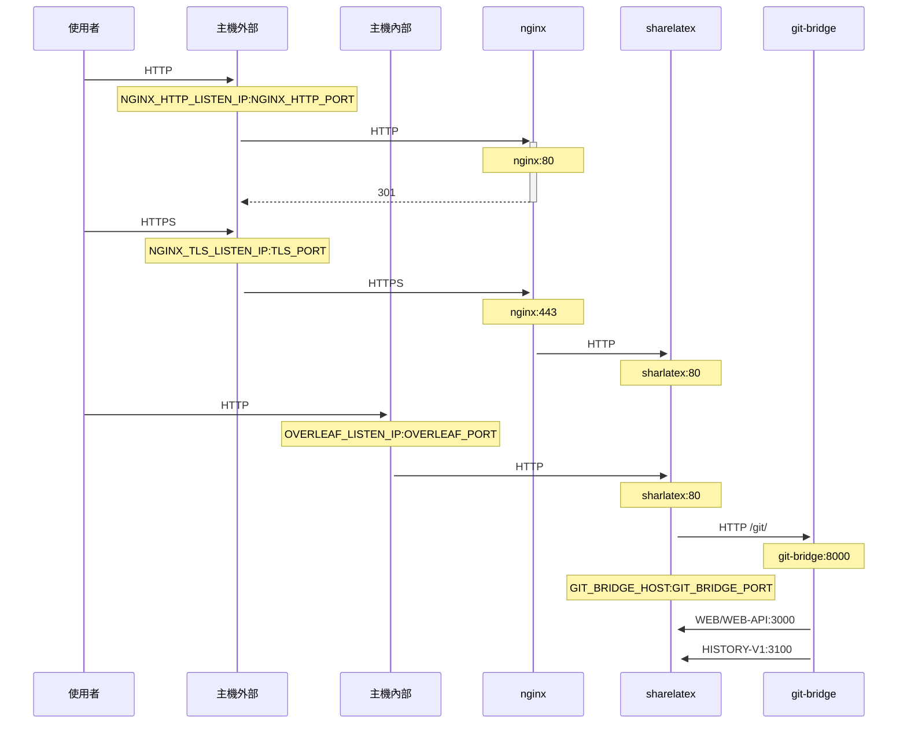

一個選用的 TLS 代理伺服器，使用 NGINX 終止 HTTPS 連線。

執行 `bin/init --tls` 以使用 NGINX 代理伺服器設定初始化本機設定，或將 NGINX 代理伺服器設定加入既有的本機設定中。系統會在 `config/nginx/certs/overleaf_key.pem` 建立一個**範例**私密金鑰，並在 `config/nginx/certs/overleaf_certificate.pem` 建立一個**假的**憑證。您可以將這些檔案替換為實際的私密金鑰與憑證，或將 `TLS_PRIVATE_KEY_PATH` 與 `TLS_CERTIFICATE_PATH` 變數的值分別設為實際私密金鑰與憑證的路徑。

`config/nginx/nginx.conf` 中提供了 NGINX 的預設設定，您可以依需求自訂。設定檔的路徑可透過 `NGINX_CONFIG_PATH` 變數變更。

<Check>

如果您使用以 **docker-compose.yml** 為基礎的部署，或自行管理 NGINX 反向代理伺服器，可以在[這裡](https://github.com/overleaf/toolkit/blob/master/lib/config-seed/nginx.conf)查看 **nginx.conf** 範例檔案。

</Check>

如果您的 `config/overleaf.rc` 檔案中尚未包含以下區段，請將其加入：

```text
# TLS proxy configuration (optional)
NGINX_ENABLED=false
NGINX_CONFIG_PATH=config/nginx/nginx.conf
NGINX_HTTP_PORT=80

# Replace these IP addresses with the external IP address of your host
NGINX_HTTP_LISTEN_IP=127.0.1.1 
NGINX_TLS_LISTEN_IP=127.0.1.1
TLS_PRIVATE_KEY_PATH=config/nginx/certs/overleaf_key.pem
TLS_CERTIFICATE_PATH=config/nginx/certs/overleaf_certificate.pem
TLS_PORT=443
```

<Danger>

如果您使用外部 TLS 代理伺服器（即非由 Overleaf Toolkit 管理），請確保在 `config/variables.env` 中設定 `OVERLEAF_TRUSTED_PROXY_IPS=loopback,<ip-of-your-tls-proxy>`，例如 `OVERLEAF_TRUSTED_PROXY_IPS=loopback,192.168.13.37`。

</Danger>

<Danger>

如果您的本機網路使用 `172.16.0.0/12`（Docker 網路的預設子網路）中的子網路，您需要在 `config/variables.env` 中設定 `OVERLEAF_TRUSTED_PROXY_IPS=loopback,<network>`。其中 `<network>` 是 `docker inspect overleaf_default` 中 `IPAM -> Config -> Subnet` 的值，例如 `OVERLEAF_TRUSTED_PROXY_IPS=loopback,172.19.0.0/16`。這是為了防止 `X-Forwarded` 標頭遭到偽造。

</Danger>

<Info>

若未手動設定 `OVERLEAF_TRUSTED_PROXY_IPS`，其預設值為 `loopback`。若手動設定，您必須確保包含 `loopback`（或 `127.0.0.1`），以信任在 **sharelatex** 容器內執行的 **nginx** 執行個體。僅接受 IP 位址與 CIDR 範圍：請勿加入 `localhost` 之類的主機名稱，否則 Overleaf 將無法啟動並回傳 `502 Bad Gateway`。

</Info>

如果您已正確設定受信任的代理伺服器 IP，應該會在 `/user/sessions` 頁面上看到您的公用 IP 位址，如下所示：

<Frame>
  
</Frame>

如果上方顯示的 IP 位址仍是類似 `127.0.0.1` 或私人／本機網路的 IP 位址，請檢查您的受信任代理伺服器設定，尤其是 `OVERLEAF_TRUSTED_PROXY_IPS` 的值。

若要執行代理伺服器，請將 `config/overleaf.rc` 中 `NGINX_ENABLED` 變數的值從 `false` 改為 `true`，然後重新執行 `bin/up`。

預設情況下，HTTPS 網頁介面可透過 `https://127.0.1.1:443` 存取。對 `http://127.0.1.1:80` 的連線會被重新導向至 `https://127.0.1.1:443`。若要變更 NGINX 監聽的 IP 位址，請設定 `NGINX_HTTP_LISTEN_IP` 與 `NGINX_TLS_LISTEN_IP` 變數。連接埠可透過 `NGINX_HTTP_PORT` 與 `TLS_PORT` 變數變更。

如果 NGINX 啟動失敗並出現錯誤訊息 `Error starting userland proxy: listen tcp4 ... bind: address already in use`，請確保 `OVERLEAF_LISTEN_IP:OVERLEAF_PORT` 與 `NGINX_HTTP_LISTEN_IP:NGINX_HTTP_PORT` 沒有重疊。


